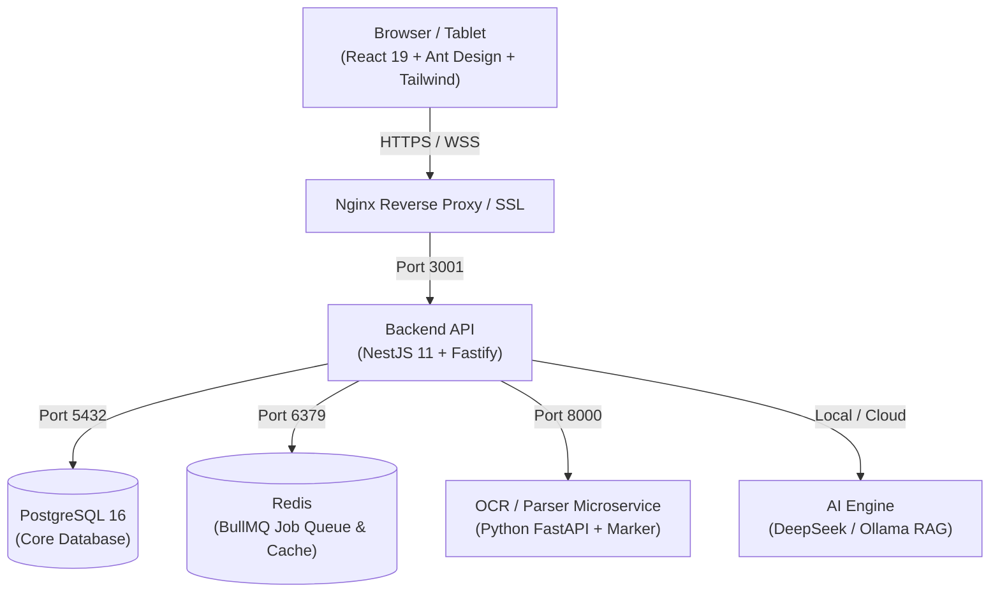

# 🏦 LPBank Smart Audit 4.0 — Hệ Thống Quản Lý Kiểm Toán Nội Bộ Toàn Diện

> **Hệ thống Quản lý Vòng đời Kiểm toán Toàn trình (Audit Management System - AMS)** tích hợp Trí tuệ Nhân tạo (AI Copilot), chuẩn mực quốc tế **IIA GIAS 2024** và quy định **Thông tư 13/2018/TT-NHNN** của Ngân hàng Nhà nước Việt Nam.

---

## 📌 1. Tổng Quan Hệ Thống

**LPBank Smart Audit 4.0** số hóa toàn diện 4 giai đoạn kiểm toán nội bộ:
1. **Lập kế hoạch (Planning)**: Vũ trụ kiểm toán (Audit Universe), ma trận chấm điểm rủi ro CAMELS, động cơ định lượng KRI và xếp hạng rủi ro đơn vị tự động.
2. **Thực hiện (Fieldwork)**: Quản lý cuộc kiểm toán, phân công nhiệm vụ, ma trận mẫu 40 cột tín dụng & 20 cột phi tín dụng, thẩm định hồ sơ giấy tờ làm việc (Working Papers) đa cấp độ (KTV $\rightarrow$ Trưởng đoàn $\rightarrow$ QA Review).
3. **Báo cáo (Reporting)**: Tự động tổng hợp sai phạm, sinh biên bản kiểm toán và dự thảo báo cáo kiểm toán đa định dạng (Word `.docx`, Excel `.xlsx`, PDF).
4. **Theo dõi Khắc phục (Remediation)**: Cổng thông tin đơn vị được kiểm toán (Auditee Portal), theo dõi tiến độ thực hiện kiến nghị, cảnh báo quá hạn thời gian thực qua WebSockets & Email.

---

## 🏗️ 2. Kiến Trúc Công Nghệ (Technology Stack)



- **Frontend**: React 19, TypeScript 5.x, Vite 6, Ant Design 5, Tailwind CSS, Lucide Icons, Playwright E2E.
- **Backend**: NestJS 11, Fastify Engine (hiệu năng cao), TypeORM, PostgreSQL 16, Passport JWT & 2FA TOTP (Google Authenticator), CASL RBAC.
- **Background Jobs**: BullMQ + Redis (Xử lý hàng đợi xuất Word/Excel, quét dữ liệu giám sát liên tục, gửi email cảnh báo).
- **Trí tuệ nhân tạo (AI Engine)**: Python FastAPI OCR microservice, DeepSeek RAG, vector embedding tài liệu quy chế ngân hàng.

---

## 🚀 3. Hướng Dẫn Khởi Chạy Nhanh (Quick Start)

### Yêu Cầu Tiên Quyết (Prerequisites)
- **Node.js**: phiên bản `>= 20.x`
- **PostgreSQL**: phiên bản `>= 15.x` (Port `5432`)
- **Redis**: phiên bản `>= 7.x` (Port `6379`, ví dụ Memurai trên Windows hoặc Redis trên Linux/Docker)

### Bước 1: Khởi động Backend
```bash
cd backend
npm install
npm run start:dev
```
> Backend chạy tại: `http://localhost:3001` (Tiền tố API: `/api`)

### Bước 2: Khởi động Frontend
```bash
cd frontend
npm install
npm run dev
```
> Frontend chạy tại: `http://localhost:5173`

---

## 👥 4. Tài Khoản Mẫu & Ma Trận Phân Quyền (Demo Accounts)

| Tên Đăng Nhập | Mật Khẩu Mặc Định | Vai Trò (Role) | Phạm Vi Quyền Hạn |
|---|---|---|---|
| `admin` | `Admin@123` | **Quản trị viên Hệ thống** | Toàn quyền cấu hình tham số, sao lưu DB, quản lý người dùng |
| `truongban` | `Ktnb@2026` | **Trưởng ban KTNB** | Phê duyệt kế hoạch năm, duyệt báo cáo kiểm toán, phân bổ nguồn lực |
| `truongdoan` | `Ktnb@2026` | **Trưởng đoàn Kiểm toán** | Lập chương trình kiểm toán, phân công KTV, soát xét giấy tờ làm việc |
| `ktv` | `Ktnb@2026` | **Kiểm toán viên** | Nhập mẫu kiểm tra, phát hiện sai phạm, tải bằng chứng |
| `auditee` | `Ktnb@2026` | **Đơn vị được kiểm toán** | Xem kiến nghị, cập nhật tiến độ giải trình và khắc phục |

---

## 🧪 5. Kiểm Thử & Đảm Bảo Chất Lượng (Quality Assurance)

Hệ thống được bảo vệ bởi bộ kiểm thử tự động toàn diện:

```bash
# Chạy toàn bộ 99 Unit Test Suites của Backend (634 tests)
cd backend
npm test

# Chạy kiểm thử End-to-End với Playwright (Frontend)
cd frontend
npx playwright test
```

Xem thêm chi tiết tại [docs/QUALITY_GATES.md](file:///docs/QUALITY_GATES.md).

---

## 📚 6. Cấu Trúc Tài Liệu Nghiệp Vụ & Kỹ Thuật (Documentation)

Hệ thống tài liệu chính thức được duy trì trong thư mục `docs/`:

- 📘 [Cẩm Nang Nghiệp Vụ KTNB & Hướng Dẫn Sử Dụng Toàn Diện](file:///docs/HUONG_DAN_SU_DUNG_VA_CAM_NANG_KTNB_TOAN_DIEN.md) — Tài liệu quy chuẩn cốt lõi (70KB) theo Thông tư 13 và IIA GIAS 2024.
- 🏛️ [Tài Liệu C4 Cấp Độ Code (C4 Code-Level Review)](file:///docs/c4_code_review_20260905_20260906.md) — Đặc tả kiến trúc mã nguồn chi tiết sau đợt refactor toàn diện.
- ⚙️ [Hướng Dẫn Triển Khai & Vận Hành Production](file:///docs/IT_VanHanh_Production.md) — Cẩm nang triển khai VPS Linux Nginx PM2 và bảo trì hệ thống.
- 🗄️ [Mô Hình Dữ Liệu Thực Thể (ERD)](file:///docs/ERD.md) — Sơ đồ quan hệ thực thể cơ sở dữ liệu PostgreSQL.

---

## 🛡️ 7. Tiêu Chuẩn Bảo Mật & An Toàn Dữ Liệu

- **Mật khẩu**: Băm Bcrypt Cost Factor 12, chính sách độ dài tối thiểu 12 ký tự, lưu lịch sử 4 mật khẩu gần nhất (PCI DSS 8.3.7).
- **Xác thực 2 yếu tố (2FA)**: Hỗ trợ TOTP qua Google Authenticator / Microsoft Authenticator (RFC 6238).
- **Chống Brute Force**: Khóa tài khoản sau 5 lần đăng nhập sai, Rate Limiting với Throttler.
- **Bảo mật API**: Bảo vệ chống Path Traversal, SSRF Protection (`ipaddr.js`), Content Security Policy (Helmet), CORS nghiêm ngặt.
