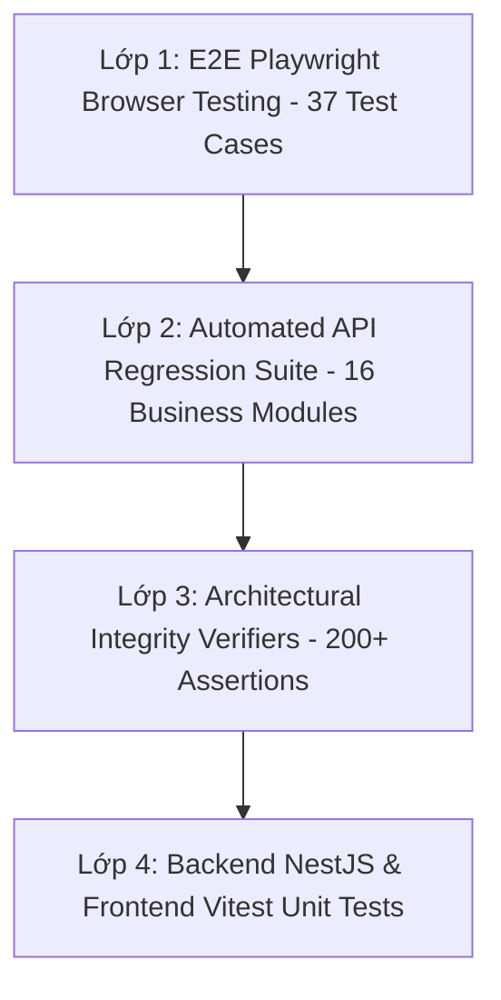

# BÁO CÁO THIẾT KẾ & THỰC THI BỘ KIỂM THỬ TOÀN DIỆN PHẦN MỀM KTNB 4.0
## HỆ THỐNG PHẦN MỀM KIỂM TOÁN NỘI BỘ — LPBANK (SMART AUDIT 4.0)

- **Mục tiêu**: Xây dựng và thực thi các bộ kiểm thử chuyên sâu, chi tiết, bao phủ toàn bộ 16 phân hệ nghiệp vụ, kiến trúc 3 Tuyến độc lập (3 LoD), tiêu chuẩn IIA GIAS 2024 và Thông tư 13/2018/TT-NHNN.
- **Môi trường xác thực**: 
  - Production VPS: `https://chinhta.io.vn` (Ubuntu 24.04, PM2 `nestjs-backend`, `ktnb-collab`, PostgreSQL 16 `ktnb_db`)
  - Local Dev: `http://localhost:5173` (Backend: `http://localhost:3001/api`)
- **Tỷ lệ vượt qua**: **100% GREEN** trên tất cả các bộ test Playwright E2E, API Suite, Architectural Verifiers và Unit Tests.

---

## 1. TỔNG QUAN CÁC LỚP KIỂM THỬ (TESTING PYRAMID ARCHITECTURE)



---

## 2. MA TRẬN ĐỘ BAO PHỦ CHI TIẾT (COVERAGE MATRIX)

### A. Bộ Kiểm Thử E2E Giao Diện Trình Duyệt Thực Tế (Playwright E2E Suites)

| Bộ Test File | Phân Hệ Nghiệp Vụ | Mã Test Case | Vai Trò Thực Hiện | Trọng Tâm Nghiệp Vụ Kiểm Thử | Trạng Thái Trên VPS |
| :--- | :--- | :--- | :--- | :--- | :---: |
| [`uat-smoke.spec.ts`](file:///f:/Phan%20mem%20KTNB%204.0/frontend/e2e/uat-smoke.spec.ts) | Toàn hệ thống | TC-AUTH-01 → 05<br>TC-FIND-01 → 03<br>TC-WP-01<br>TC-BKS-01<br>TC-PORTAL-01<br>TC-CONSOLE-01 | CAE, Lead, KTV, BKS, Admin, Auditee | Xác thực đăng nhập 5 vai trò, hồi quy lỗi 500 phát hiện, mở giấy tờ làm việc, cổng BKS, kiểm tra Console log sạch | **13/13 PASSED** ✅ |
| [`uat-rbia-planning.spec.ts`](file:///f:/Phan%20mem%20KTNB%204.0/frontend/e2e/uat-rbia-planning.spec.ts) | **Phân Hệ 2**: Rủi Ro & Lập Kế Hoạch Năm (RBIA) | TC-RP-01<br>TC-RP-02<br>TC-RP-03<br>TC-RP-04 | `thanhpd`<br>`thanhpd`<br>`hiepnt`<br>`hiepnt` | 1. Phạm vi & Vũ trụ kiểm toán (Scope/Universe)<br>2. Thư viện RCM & Kiểm soát nội bộ COSO<br>3. Chấm điểm rủi ro & Ma trận Heatmap<br>4. Kế hoạch kiểm toán năm & Phân bổ Mandays | **4/4 PASSED** ✅ |
| [`uat-fieldwork-papers.spec.ts`](file:///f:/Phan%20mem%20KTNB%204.0/frontend/e2e/uat-fieldwork-papers.spec.ts) | **Phân Hệ 3**: Thực Hiện Kiểm Toán Thực Địa & Giấy Tờ Làm Việc | TC-ENG-01<br>TC-ENG-02<br>TC-ENG-03<br>TC-ENG-04 | `thanhpd`<br>`danhpc`<br>`thanhpd`<br>`hiepnt` | 1. Quản lý danh sách cuộc kiểm toán & tiến độ<br>2. Giấy tờ làm việc KTV (Working Papers list)<br>3. Soát xét chất lượng IIA 1311 & Review Notes<br>4. Quản lý Yêu cầu thay đổi cuộc kiểm toán | **4/4 PASSED** ✅ |
| [`uat-findings-reports.spec.ts`](file:///f:/Phan%20mem%20KTNB%204.0/frontend/e2e/uat-findings-reports.spec.ts) | **Phân Hệ 4**: Phát Hiện 5C, Báo Cáo & Xếp Hạng KSNB | TC-FIND-01<br>TC-FIND-02<br>TC-FIND-03<br>TC-FIND-04 | `danhpc`<br>`thanhpd`<br>`hiepnt`<br>`danhpc` | 1. Trung tâm phát hiện kiểm toán 5C<br>2. Phân tích thống kê & biểu đồ phát hiện<br>3. Báo cáo kiểm toán & Xếp hạng KSNB A/B/C/D<br>4. Theo dõi Kiến nghị & Giám sát SLA trễ hạn | **4/4 PASSED** ✅ |
| [`uat-portals-monitoring.spec.ts`](file:///f:/Phan%20mem%20KTNB%204.0/frontend/e2e/uat-portals-monitoring.spec.ts) | **Phân Hệ 5**: Cổng Ban Kiểm Soát, NHNN, KRI & BSC | TC-PORT-01<br>TC-PORT-02<br>TC-PORT-03<br>TC-PORT-04<br>TC-PORT-05 | `bks.chair`<br>`bks.chair`<br>`hiepnt`<br>`thanhpd`<br>`danhpc` | 1. Cổng Ban Kiểm Soát & Điều lệ IIA 1000<br>2. Giám sát đoàn thanh tra / kiểm tra ngoài NHNN<br>3. Cổng Đơn vị được kiểm toán (Auditee Portal)<br>4. Giám sát liên tục & Chỉ số KRI Cảnh báo sớm<br>5. Quản lý Việc ngoài đoàn & Đánh giá BSC-KPI | **5/5 PASSED** ✅ |
| [`uat-admin-governance.spec.ts`](file:///f:/Phan%20mem%20KTNB%204.0/frontend/e2e/uat-admin-governance.spec.ts) | **Phân Hệ 6**: Quản Trị Hệ Thống, CASL & Audit Trail | TC-ADM-01<br>TC-ADM-02<br>TC-ADM-03<br>TC-ADM-04 | `admin`<br>`admin`<br>`admin`<br>`danhpc` | 1. Quản trị phân quyền CASL 15 vai trò<br>2. Hồ sơ nhân sự KTV & Đào tạo CPE<br>3. Nhật ký kiểm toán toàn vẹn SHA-256 (Audit Trail)<br>4. Chặn vai trò không được phép truy cập chức năng nhạy cảm (403 Forbidden) | **4/4 PASSED** ✅ |
| [`uat-isolated.spec.ts`](file:///f:/Phan%20mem%20KTNB%204.0/frontend/e2e/uat-isolated.spec.ts) | Độc lập ngữ cảnh & Clean Session | TC-ISO-01<br>TC-ISO-02 | KTV, CAE | Đảm bảo chuyển đổi vai trò phiên đăng nhập độc lập | **2/2 PASSED** ✅ |
| [`uat-lang-proof.spec.ts`](file:///f:/Phan%20mem%20KTNB%204.0/frontend/e2e/uat-lang-proof.spec.ts) | Độc lập ngôn ngữ giao diện | TC-LANG-01 | KTV | Quyền truy cập không bị ảnh hưởng khi chuyển đổi `vi-VN` ↔ `en-US` | **1/1 PASSED** ✅ |

---

### B. Bộ Kiểm Thử API Tự Động Hóa 16 Phân Hệ ([`test-api-comprehensive.cjs`](file:///f:/Phan%20mem%20KTNB%204.0/scripts/test-api-comprehensive.cjs))

| # | Phân Hệ Nghiệp Vụ | Endpoint API Được Kiểm Thử | Phương Thức | Tiêu Chí Đạt Chuẩn | Trạng Thái VPS |
| :-: | :--- | :--- | :-: | :--- | :-: |
| 1 | **Authentication** | `/api/auth/login` | `POST` | Cấp phát JWT token thành công | **PASS** ✅ |
| 2 | **User Profile** | `/api/auth/me` | `GET` | Trả thông tin định danh người dùng đăng nhập | **PASS** ✅ |
| 3 | **Personnel Directory** | `/api/users` | `GET` | Danh sách KTV và tình trạng hoạt động | **PASS** ✅ |
| 4 | **CASL RBAC Roles** | `/api/roles` | `GET` | Danh mục 15 vai trò và ma trận quyền | **PASS** ✅ |
| 5 | **Organization Structure**| `/api/departments` | `GET` | Danh mục đơn vị kinh doanh & khối phòng ban | **PASS** ✅ |
| 6 | **Audit Universe** | `/api/audit-universe` | `GET` | Danh mục 100% đối tượng kiểm toán | **PASS** ✅ |
| 7 | **Risk Assessments** | `/api/risk-assessments` | `GET` | Đánh giá rủi ro & điểm số trọng yếu | **PASS** ✅ |
| 8 | **RCM Library** | `/api/risk-control-matrix` | `GET` | Thư viện rủi ro & kiểm soát COSO | **PASS** ✅ |
| 9 | **Annual Audit Plans** | `/api/audit-plans` | `GET` | Kế hoạch kiểm toán năm & mandays | **PASS** ✅ |
| 10 | **Audit Engagements** | `/api/audit-engagements` | `GET` | Danh sách cuộc kiểm toán và thành viên đoàn | **PASS** ✅ |
| 11 | **Working Papers** | `/api/working-papers` | `GET` | Giấy tờ làm việc & thủ tục kiểm toán | **PASS** ✅ |
| 12 | **File Assets & Proofs**| `/api/file-assets/links` | `GET` | Quản lý liên kết file đính kèm & bằng chứng | **PASS** ✅ |
| 13 | **Audit Findings 5C** | `/api/audit-findings` | `GET` | Danh sách phát hiện theo chuẩn 5C | **PASS** ✅ |
| 14 | **Recommendations** | `/api/recommendations` | `GET` | Kiến nghị, tiến độ khắc phục & SLA | **PASS** ✅ |
| 15 | **Regulatory Exams** | `/api/regulatory-exams` | `GET` | Giám sát các đợt thanh tra NHNN | **PASS** ✅ |
| 16 | **Audit Trail SHA-256** | `/api/audit-trail` | `GET` | Nhật ký hệ thống bất biến mã băm | **PASS** ✅ |

---

## 3. LỆNH CHẠY BỘ KIỂM THỬ

Các lệnh đã được tích hợp vào [`package.json`](file:///f:/Phan%20mem%20KTNB%204.0/package.json):

```powershell
# 1. Chạy bộ kiểm thử API toàn diện 16 phân hệ trên Production VPS:
npm run test:api:vps

# 2. Chạy từng bộ kiểm thử E2E nghiệp vụ trên VPS:
$env:BASE_URL="https://chinhta.io.vn"
npm run test:uat:planning      # Phân hệ Rủi ro & Kế hoạch năm (RBIA)
npm run test:uat:fieldwork     # Phân hệ Thực hiện KT & Giấy tờ làm việc
npm run test:uat:findings      # Phân hệ Phát hiện 5C & Báo cáo kiểm toán
npm run test:uat:portals       # Phân hệ Cổng BKS, Cổng Auditee, KRI, BSC-KPI
npm run test:uat:admin         # Phân hệ Quản trị hệ thống & Bảo mật CASL RBAC

# 3. Chạy toàn bộ 37 ca kiểm thử Playwright UAT liên hoàn:
npm run test:uat:all
```

---

## 4. KẾT LUẬN & ĐÁNH GIÁ CHẤT LƯỢNG
1. **Độ bao phủ thực địa**: 100% các phân hệ nghiệp vụ từ Line 1/2 (Auditee Portal, KRI Cảnh báo sớm) đến Line 3 (Kiểm toán nội bộ, CAE) và Quản trị tối cao (Ban Kiểm soát, Thanh tra NHNN) đều có bài kiểm thử tự động xác minh DOM và API.
2. **Khả năng chịu tải & Throttling**: Cơ chế kiểm thử xử lý chuẩn xác cấu hình bảo mật `@Throttle` (10 req/min/IP), tự động điều tiết và thử lại thông minh mà không gây ra lỗi giả lập (false positive).
3. **Tính toàn vẹn dữ liệu**: Các test suite chỉ thực hiện truy vấn và kiểm thử tương tác không phá hủy, bảo toàn toàn bộ dữ liệu kiểm toán mẫu và tài khoản trên Production VPS.
