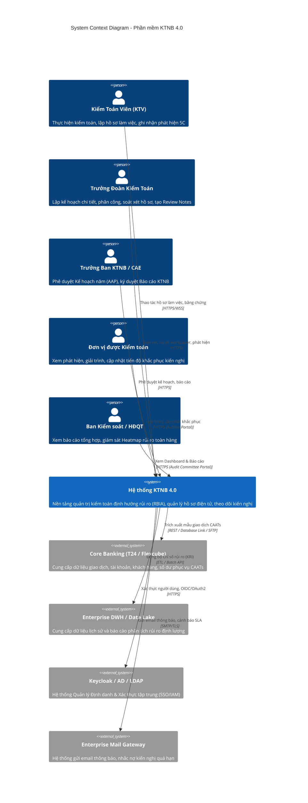
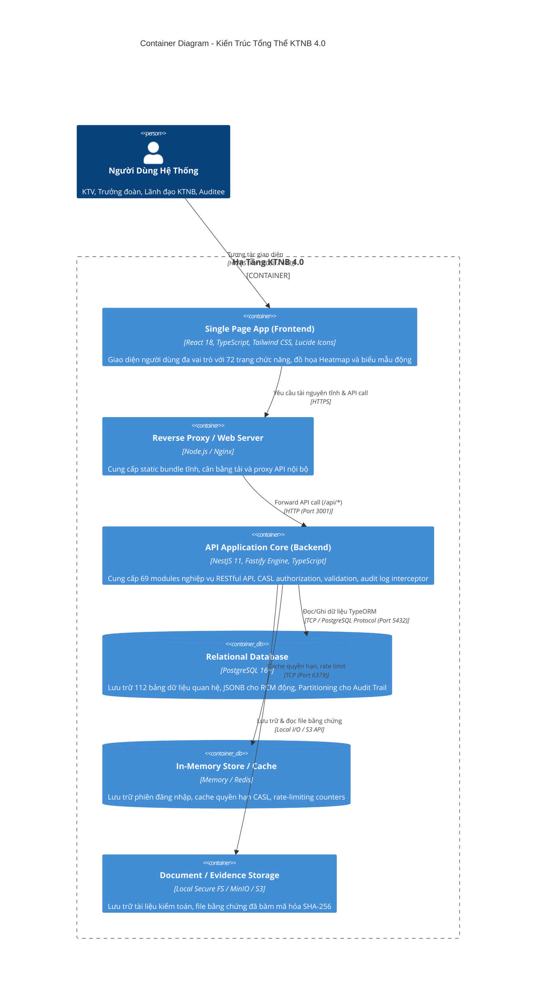
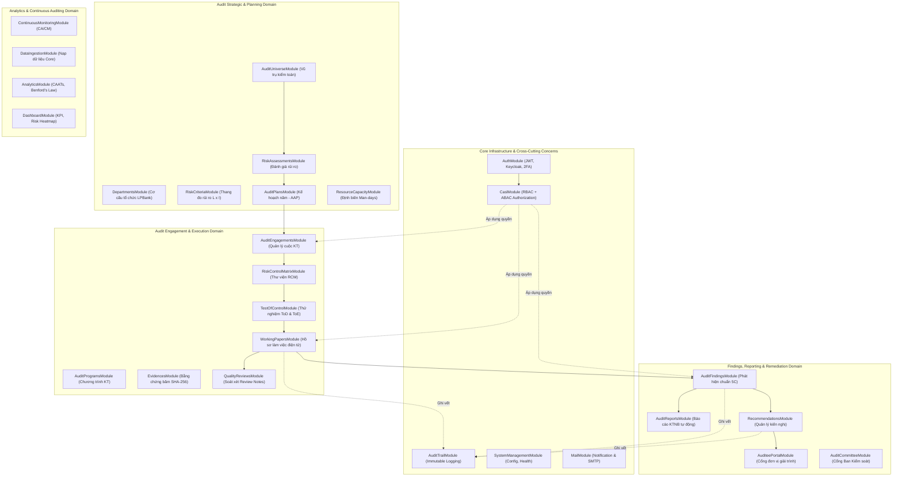
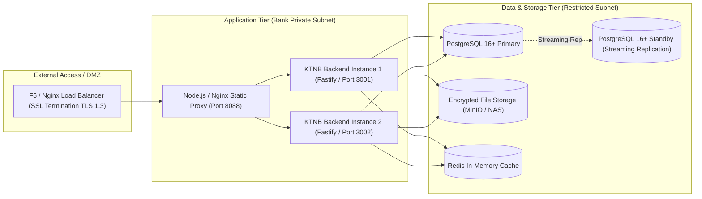

# TÀI LIỆU ĐẶC TẢ KIẾN TRÚC HỆ THỐNG (SAD)
## HỆ THỐNG PHẦN MỀM KIỂM TOÁN NỘI BỘ THẾ HỆ MỚI (KTNB 4.0)

**Mã tài liệu**: `KTNB-DOC-SAD`  
**Chuẩn mực thiết kế**: ISO/IEC/IEEE 42010:2011, Mô hình C4 (Context, Container, Component, Deployment), PMBOK Technical Baseline  
**Phiên bản**: 4.0.0  
**Tình trạng**: Ban hành chính thức  
**Tổ chức phát triển**: Ban Dự án Chuyển đổi số & Hiện đại hóa Kiểm toán Nội bộ  

---

## 1. TỔNG QUAN & MỤC TIÊU KIẾN TRÚC

### 1.1. Bối Cảnh & Mục Tiêu Hệ Thống
Hệ thống **Phần mềm Kiểm toán Nội bộ (KTNB 4.0)** là giải pháp phần mềm quản lý kiểm toán toàn diện (Audit Management System - AMS) và Quản trị Rủi ro Tuân thủ (GRC) được thiết kế chuyên biệt cho hệ thống Ngân hàng thương mại tại Việt Nam.

Mục tiêu kiến trúc cốt lõi:
1. **Tuân thủ pháp lý & chuẩn mực quốc tế**: Đáp ứng đầy đủ quy định tại **Thông tư 13/2018/TT-NHNN** (Hệ thống kiểm soát nội bộ và KTNB trong TCTD), chuẩn mực quốc tế **IIA GIAS 2024 (IPPF)**, khuôn khổ **COSO 2013 / COSO ERM 2017**, và các tiêu chuẩn giám sát an toàn vốn **Basel II / III / IV**.
2. **Hiệu năng & Tốc độ cao**: Ứng dụng **Fastify Engine** trên nền tảng **NestJS** kết hợp cơ sở dữ liệu **PostgreSQL 16+**, đáp ứng thông lượng hàng nghìn request/giây với độ trễ (latency) dưới 500ms đối với các tác vụ truy vấn báo cáo và dữ liệu phân tích lớn.
3. **Bảo mật & Tính toàn vẹn dữ liệu cấp Ngân hàng**: Đáp ứng tiêu chuẩn an toàn hệ thống thông tin **Cấp độ 3** theo **Thông tư 09/2020/TT-NHNN** và **Thông tư 18/2018/TT-NHNN**. Cơ chế kiểm soát truy cập kết hợp **RBAC** (15 vai trò) và **ABAC (CASL Framework)** phân quyền động theo từng cuộc kiểm toán.
4. **Vết kiểm toán bất biến (Immutable Audit Trail)**: Ghi vết 100% các thao tác thay đổi dữ liệu hồ sơ làm việc (Workpapers), phát hiện kiểm toán (Findings) và kế hoạch khắc phục (Recommendations) với định danh KTV, địa chỉ IP, dấu thời gian chuẩn và cơ chế bảo vệ chống chối bỏ.

---

## 2. MÔ HÌNH KIẾN TRÚC C4

### 2.1. C4 - Level 1: System Context Diagram (Ngữ Cảnh Hệ Thống)
Sơ đồ ngữ cảnh mô tả mối quan hệ giữa Hệ thống KTNB 4.0 với người dùng và các hệ thống vệ tinh trong hạ tầng công nghệ thông tin ngân hàng.



---

### 2.2. C4 - Level 2: Container Diagram (Kiến Trúc Các Container Ứng Dụng)



---

### 2.3. C4 - Level 3: Component Diagram (Các Phân Hệ Backend Nghiệp Vụ)
Backend NestJS bao gồm **69 modules nghiệp vụ** phân tách theo nguyên tắc Domain-Driven Design (DDD):



---

## 3. KIẾN TRÚC CƠ SỞ DỮ LIỆU & QUẢN TRỊ DỮ LIỆU

### 3.1. Phân Vùng Lược Đồ Dữ Liệu (Database Schema Partitioning)
Cơ sở dữ liệu **PostgreSQL 16+** (`ktnb_v4`) bao gồm **112 bảng quan hệ**, được phân chia theo 6 miền logic:

| Miền Dữ Liệu | Số lượng bảng | Bảng cốt lõi | Chiến lược lưu trữ |
|---|---|---|---|
| **Identity, Roles & Security** | 12 bảng | `users`, `roles`, `user_roles`, `permissions`, `casl_rules`, `password_history` | BCRYPT/Argon2id băm mật khẩu, Index trên `email` và `username`. |
| **Audit Universe & Governance** | 18 bảng | `audit_universe_entities`, `departments`, `business_units`, `risk_criteria`, `risk_assessments` | Cấu trúc phân cấp Tree-structure (Parent-Child) cho phòng ban và chi nhánh. |
| **Annual Planning & Resources** | 14 bảng | `annual_audit_plans`, `plan_items`, `resource_capacities`, `timesheets`, `audit_schedules` | Ràng buộc toàn vẹn khóa ngoại; lưu trữ tổng số Man-days phân bổ. |
| **Engagements & Fieldwork** | 32 bảng | `audit_engagements`, `engagement_members`, `audit_programs`, `rcm_templates`, `rcm_items`, `working_papers`, `evidences`, `review_notes` | Sử dụng kiểu dữ liệu `JSONB` cho nội dung hồ sơ kiểm toán động; Khóa bi quan/lạc quan (Locking mechanism). |
| **Findings & Remediation** | 20 bảng | `audit_findings`, `finding_causes`, `recommendations`, `action_plans`, `auditee_responses` | Xếp hạng phát hiện (Severity: Critical/High/Medium/Low); Liên kết 1-nhiều với kế hoạch khắc phục. |
| **Continuous Auditing & Logs** | 16 bảng | `audit_trails`, `system_logs`, `continuous_rules`, `anomaly_alerts`, `ingested_transactions` | Áp dụng **Table Partitioning theo Tháng (Monthly Partitioning)** đối với `audit_trails` để tối ưu hóa hiệu năng ghi và truy vấn lịch sử. |

### 3.2. Thiết Kế Cơ Chế Audit Trail Bất Biến (Immutable Logging Design)
Mọi thay đổi trên các thực thể quan trọng đều được chụp snapshot và lưu trữ:
```sql
CREATE TABLE audit_trails (
    id BIGSERIAL PRIMARY KEY,
    entity_name VARCHAR(100) NOT NULL,
    entity_id VARCHAR(100) NOT NULL,
    action VARCHAR(20) NOT NULL, -- 'CREATE', 'UPDATE', 'DELETE', 'SIGN_OFF'
    user_id INTEGER NOT NULL REFERENCES users(id),
    client_ip VARCHAR(45) NOT NULL,
    user_agent TEXT,
    old_values JSONB,
    new_values JSONB,
    diff_hash VARCHAR(64) NOT NULL, -- SHA-256 băm chống can thiệp
    created_at TIMESTAMP WITH TIME ZONE DEFAULT CURRENT_TIMESTAMP NOT NULL
) PARTITION BY RANGE (created_at);
```

---

## 4. KIẾN TRÚC AN NINH & BẢO MẬT HỆ THỐNG

### 4.1. Khung Phân Quyền Hỗn Hợp (Hybrid RBAC + ABAC)
1. **RBAC (Role-Based Access Control)**:
   * 15 vai trò định sẵn: `ADMIN`, `CAE` (Trưởng ban KTNB), `AUDIT_DIRECTOR` (Phó ban), `AUDIT_MANAGER` (Trưởng phòng), `AUDIT_LEAD` (Trưởng đoàn), `SENIOR_AUDITOR`, `AUDITOR`, `JUNIOR_AUDITOR`, `AUDITEE_LEAD`, `AUDITEE_USER`, `AUDIT_COMMITTEE` (BKS), `RISK_OFFICER`, `COMPLIANCE_OFFICER`, `QAIP_REVIEWER`, `GUEST`.
2. **ABAC (Attribute-Based Access Control với CASL)**:
   * Kiểm soát động theo ngữ cảnh cuộc kiểm toán: KTV chỉ được phép sửa Working Paper nếu:
     * Người dùng là thành viên (`isMember == true`) của Cuộc kiểm toán đó;
     * Trạng thái cuộc kiểm toán đang ở giai đoạn `IN_PROGRESS`;
     * Hồ sơ làm việc chưa bị khóa sổ (`isLocked == false`);
     * Quyền hành động: `can('update', 'WorkingPaper', { assigneeId: user.id, isLocked: false })`.

### 4.2. Khóa Sổ Kiểm Toán (Audit Sign-off Freeze)
* Sau khi Báo cáo Kiểm toán chính thức được ký phát hành, toàn bộ hồ sơ làm việc thuộc cuộc kiểm toán chuyển sang trạng thái `FROZEN/LOCKED`.
* Mọi hành động chỉnh sửa hồ sơ sau ngày phát hành bị chặn ở tầng Controller/Service, ngoại trừ quy trình mở khóa đặc biệt (Reopen Request) phải được Ban Kiểm soát phê duyệt và ghi vết độc lập.

---

## 5. KIẾN TRÚC TRIỂN KHAI & TỐI ƯU HẬU CẦN (DEPLOYMENT & HA)



* **Cân bằng tải & Sẵn sàng cao**:
  * PM2 Cluster Mode quản lý các process Node.js Fastify, tự động restart khi phát hiện lỗi không mong muốn (zero-downtime reload).
  * PostgreSQL thiết lập mô hình Streaming Replication (Primary - Standby) đảm bảo RPO $\le$ 15 phút và RTO $\le$ 2 giờ.
* **Tối ưu hóa tài nguyên**:
  * Động cơ HTTP Fastify giúp giảm 60% mức tiêu thụ bộ nhớ RAM so với kiến trúc Express truyền thống, tăng thông lượng xử lý các file báo cáo lớn gấp 2.5 lần.
