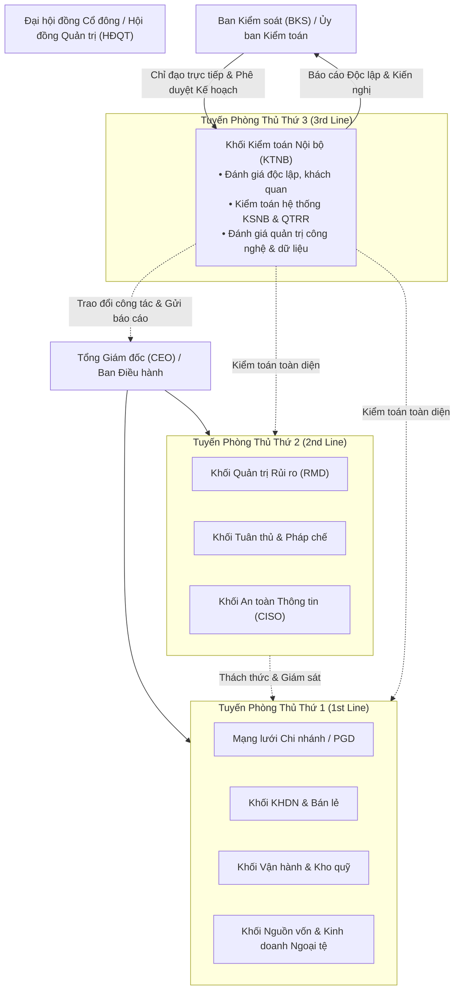
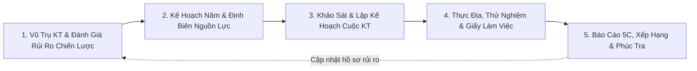
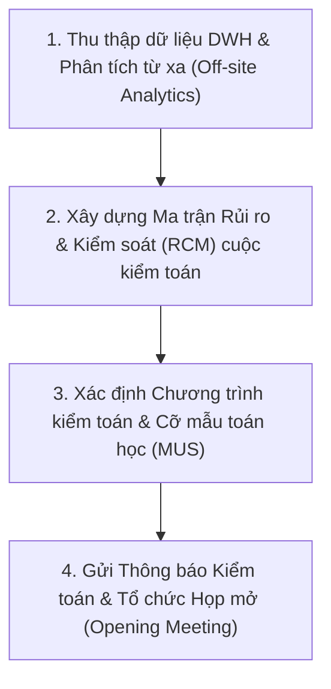

# CẨM NANG PHƯƠNG PHÁP LUẬN KIỂM TOÁN NỘI BỘ NGÂN HÀNG THƯƠNG MẠI
## (RISK-BASED INTERNAL AUDIT METHODOLOGY & CAATS HANDBOOK)
### HỆ THỐNG PHẦN MỀM KIỂM TOÁN NỘI BỘ THẾ HỆ MỚI (KTNB 4.0)

---

## LỜI NÓI ĐẦU & CĂN CỨ QUY CHIẾU

Tài liệu này chuẩn hóa toàn bộ **Phương pháp luận Kiểm toán Nội bộ dựa trên Rủi ro (Risk-Based Internal Audit - RBIA)** và **Kỹ thuật Kiểm toán có sự trợ giúp của Máy tính (Computer-Assisted Audit Techniques - CAATs)** áp dụng thống nhất trong toàn hệ thống Ngân hàng Thương mại Cổ phần Bưu điện Liên Việt (LPBank) và tích hợp vào **Hệ thống Phần mềm KTNB 4.0**.

Tài liệu được xây dựng trên cơ sở quy chiếu chặt chẽ theo các khung chuẩn mực quốc tế và quy định pháp lý của Ngân hàng Nhà nước Việt Nam (NHNN):
1. **Chuẩn mực Kiểm toán Nội bộ Toàn cầu IIA GIAS (Global Internal Audit Standards 2024 / IPPF)** của Viện Kiểm toán Nội bộ Quốc tế (The Institute of Internal Auditors).
2. **Mô hình 3 Tuyến Phòng Thủ (IIA Three Lines Model 2020)**.
3. **Khung Quản trị Rủi ro & Kiểm soát Nội bộ COSO (COSO Internal Control 2013 & COSO ERM 2017)**.
4. **Hiệp ước Vốn Basel (Basel II / Basel III / BCBS 223)** về nguyên tắc kiểm toán nội bộ trong các tổ chức tín dụng.
5. **Thông tư số 13/2018/TT-NHNN** (và Thông tư 40/2018/TT-NHNN sửa đổi, bổ sung) quy định về **Hệ thống kiểm soát nội bộ của Tổ chức tín dụng, Chi nhánh ngân hàng nước ngoài**.
6. **Luật Các tổ chức tín dụng năm 2024** (Luật số 32/2024/QH15).
7. **Thông tư số 11/2021/TT-NHNN** về phân loại tài sản có, mức trích, phương pháp trích lập dự phòng rủi ro và sử dụng dự phòng xử lý rủi ro.
8. **Thông tư số 39/2016/TT-NHNN**, **Thông tư 06/2023/TT-NHNN** và **Thông tư 10/2023/TT-NHNN** về hoạt động cho vay.
9. **Thông tư số 09/2020/TT-NHNN** về an toàn hệ thống thông tin trong hoạt động ngân hàng.
10. **Thông tư số 09/2023/TT-NHNN** và Luật Phòng, chống rửa tiền năm 2022.

---

# PHẦN I: KHUNG KIẾN TRÚC QUẢN TRỊ & MÔ HÌNH 3 TUYẾN PHÒNG THỦ

## 1. Vị Trí, Quyền Hạn & Tính Độc Lập của KTNB trong Ngân Hàng

Theo **Thông tư 13/2018/TT-NHNN** và **Domain III của IIA GIAS 2024**, Khối Kiểm toán Nội bộ là **Tuyến phòng thủ thứ 3**, trực thuộc và báo cáo trực tiếp lên **Ban Kiểm soát (BKS)**:



### Nguyên Tắc Hoạt Động Cốt Lõi:
1. **Tính Độc lập (Independence)**:
   - KTNB độc lập với các đơn vị, bộ phận điều hành kinh doanh và quản lý rủi ro tuyến 1, tuyến 2.
   - Kiểm toán viên nội bộ (KTV) không tham gia vào việc xây dựng quy trình kinh doanh, phê duyệt cấp tín dụng, hạch toán kế toán hoặc điều hành tác nghiệp.
   - KTV không được kiểm toán đơn vị, hoạt động mà mình từng chịu trách nhiệm quản lý hoặc điều hành trong vòng ít nhất **01 năm (12 tháng)** trước đó.
2. **Tính Khách quan (Objectivity)**:
   - KTV duy trì thái độ hoài nghi nghề nghiệp (*Professional Skepticism*), thu thập bằng chứng đầy đủ, tin cậy và không chịu sự can thiệp từ bất kỳ cá nhân, phòng ban nào khi đưa ra phát hiện kiểm toán.
3. **Thẩm Quyền Tối Cao (Audit Mandate)**:
   - Được quyền truy cập không giới hạn vào tất cả các hệ thống CNTT (Core Banking, DWH, CRM, LOS, ERP), cơ sở dữ liệu, sổ sách, chứng từ kế toán, biên bản họp Hội đồng và tài liệu nghiệp vụ của ngân hàng.
   - Được quyền yêu cầu mọi cán bộ nhân viên, lãnh đạo phòng ban giải trình, cung cấp thông tin và xác nhận số liệu kịp thời.

---

# PHẦN II: PHƯƠNG PHÁP LUẬN KIỂM TOÁN DỰA TRÊN RỦI RO (RBIA)

Quy trình Kiểm toán Nội bộ dựa trên Rủi ro của ngân hàng được vận hành theo chu trình 5 giai đoạn khép kín:



---

## 1. GIAI ĐOẠN 1: VŨ TRỤ KIỂM TOÁN & ĐÁNH GIÁ RỦI RO (AUDIT UNIVERSE & RISK ASSESSMENT)

### 1.1. Xây Dựng Vũ Trụ Kiểm Toán (Audit Universe)
Vũ trụ kiểm toán bao quát 100% đối tượng có thể được kiểm toán trong ngân hàng, phân cấp thành 4 cấp độ:
* **Cấp 1 - Khối/Cụm Nghiệp vụ**: Tín dụng, Nguồn vốn & Thị trường tài chính, Vận hành & Thanh toán, Ngân hàng số & CNTT, Quản trị rủi ro & Tuân thủ, Tài chính kế toán, Nhân sự & Hành chính.
* **Cấp 2 - Đơn vị/Phòng ban trực thuộc**: Mạng lưới Chi nhánh loại 1, Chi nhánh loại 2, Phòng Giao dịch (PGD), Phòng/Ban Hội sở.
* **Cấp 3 - Quy trình Nghiệp vụ (Business Process)**: Cho vay KHDN, Cho vay Thấu chi, Thẩm định tài sản bảo đảm, Mua bán ngoại tệ (FX Spot/Forward), Phát hành Thư tín dụng (L/C), Quản lý quỹ ATM, Quản trị an toàn cơ sở dữ liệu...
* **Cấp 4 - Hệ thống CNTT / Sản phẩm cụ thể**: Core Banking T24, Hệ thống khởi tạo khoản vay (LOS), Mobile Banking App, Hệ thống Swift, Hệ thống Smart Loyalty...

---

### 1.2. Ma Trận & Công Thức Đánh Giá Rủi Ro Định Lượng

Mỗi đối tượng trong Vũ trụ kiểm toán được đánh giá rủi ro hàng năm theo mô hình toán học 3 tầng:

#### 1. Rủi Ro Cố Hữu (Inherent Risk - IR):
Là rủi ro tiềm ẩn tự nhiên của quy trình/đơn vị khi chưa có biện pháp kiểm soát nội bộ.
$$\text{IR} = \text{Likelihood (L)} \times \text{Impact (I)}$$

* **Thang đo Khả năng xảy ra (Likelihood - L) từ 1 đến 5**:
  - `1 - Rất thấp`: Dưới 1 lần trong 5 năm.
  - `2 - Thấp`: 1 lần trong 3 - 5 năm.
  - `3 - Trung bình`: 1 lần trong 1 - 2 năm.
  - `4 - Cao`: Nhiều lần trong 1 năm.
  - `5 - Rất cao`: Xảy ra thường xuyên hàng tháng/hàng tuần.

* **Thang đo Mức độ tác động (Impact - I) từ 1 đến 5** (Đánh giá trên 4 khía cạnh trọng số):
  $$\text{Impact} = 0.4 \times I_{\text{Tài chính}} + 0.3 \times I_{\text{Pháp lý/Tuân thủ}} + 0.15 \times I_{\text{Vận hành}} + 0.15 \times I_{\text{Uy tín}}$$

| Tiêu Chí Tác Động | Mức 1 (Không đáng kể) | Mức 2 (Nhỏ) | Mức 3 (Trung bình) | Mức 4 (Lớn) | Mức 5 (Nghiêm trọng) |
|---|---|---|---|---|---|
| **Tài chính ($I_{\text{TC}}$)** | Thất thoát < 50 triệu | 50 triệu - 500 triệu | 500 triệu - 5 tỷ | 5 tỷ - 20 tỷ | Thất thoát > 20 tỷ VND |
| **Pháp lý ($I_{\text{PL}}$)** | Nhắc nhở nội bộ | Xử phạt hành chính < 50tr | Thanh tra NHNN cảnh báo | Xử phạt nặng, đình chỉ SP | Khởi tố hình sự, rút giấy phép |
| **Vận hành ($I_{\text{VH}}$)** | Gián đoạn < 30 phút | Gián đoạn 30p - 2h | Gián đoạn 2h - 8h | Gián đoạn 8h - 24h | Tê liệt hệ thống > 24 giờ |
| **Uy tín ($I_{\text{UT}}$)** | Phàn nàn cá biệt | Báo chí địa phương nêu | Truyền thông MXH lan truyền | Khủng hoảng báo chí quốc gia | Rút tiền hàng loạt (Bank run) |

---

#### 2. Hiệu Lực Hệ Thống Kiểm Soát Nội Bộ (Control Effectiveness - CE):
Đo lường mức độ thiết kế và vận hành hữu hiệu của các chốt kiểm soát tuyến 1 và tuyến 2, chấm theo thang điểm 1 đến 5:
* `5 - Rất tốt (Strong)`: Kiểm soát tự động trên hệ thống (System Automated Control), phân quyền chặt chẽ, kiểm soát kép 100%, có giám sát thời gian thực. (Hệ số giảm trừ $\alpha = 0.8$).
* `4 - Tốt (Adequate)`: Kiểm soát hỗn hợp hệ thống & thủ công, quy trình văn bản hóa rõ ràng, kiểm tra định kỳ đầy đủ. ($\alpha = 0.6$).
* `3 - Trung bình (Fair)`: Chủ yếu kiểm soát thủ công, phụ thuộc vào con người, đôi khi phát sinh lỗi sót chứng từ. ($\alpha = 0.4$).
* `2 - Yếu (Weak)`: Quy trình thiếu chốt kiểm soát quan trọng, không có sự phân tách trách nhiệm (SoD). ($\alpha = 0.2$).
* `1 - Rất yếu (Poor)`: Không có kiểm soát, buông lỏng quản lý, thường xuyên vi phạm. ($\alpha = 0.0$).

---

#### 3. Rủi Ro Còn Lại (Residual Risk - RR) & Chu Kỳ Kiểm Toán:
$$\text{Residual Risk Score (RR)} = \text{Inherent Risk (IR)} \times (1 - \alpha)$$

Dựa trên điểm số rủi ro còn lại, hệ thống phân loại và gán **Chu kỳ kiểm toán bắt buộc** tuân thủ Thông tư 13/2018/TT-NHNN:

| Điểm Rủi Ro Còn Lại (RR) | Phân Loại Rủi Ro | Mã Màu | Chu Kỳ Kiểm Toán Bắt Buộc | Tần Suất Giám Sát Liên Tục |
|:---:|:---:|:---:|:---:|:---:|
| **$15.0 \le \text{RR} \le 25.0$** | **RỦI RO CAO (HIGH)** | 🔴 Đỏ | **Tối thiểu 01 năm / 01 lần** (Quy định bắt buộc TT 13) | Giám sát KRI tự động hàng ngày/tuần |
| **$7.0 \le \text{RR} < 15.0$** | **RỦI RO TRUNG BÌNH (MEDIUM)** | 🟡 Vàng | **Tối thiểu 02 năm / 01 lần** | Rà soát chỉ số giám sát hàng tháng |
| **$1.0 \le \text{RR} < 7.0$** | **RỦI RO THẤP (LOW)** | 🟢 Xanh lá | **Tối thiểu 03 năm / 01 lần** (Quy định quét toàn bộ TT 13) | Rà soát báo cáo giám sát hàng quý |

---

## 2. GIAI ĐOẠN 2: LẬP KẾ HOẠCH KIỂM TOÁN HÀNG NĂM (ANNUAL AUDIT PLANNING - AAP)

### 2.1. Quy Trình Phê Duyệt Kế Hoạch Năm
* **Tháng 10 - Tháng 11**: Khối KTNB thực hiện đánh giá rủi ro cập nhật toàn bộ Vũ trụ kiểm toán, thu thập phản hồi từ HĐQT, BKS, Ban Điều hành và Khối QTRR.
* **Tháng 12**: Trưởng Ban Kiểm toán Nội bộ hoàn thiện dự thảo Kế hoạch Kiểm toán Hàng năm (AAP) và trình Ban Kiểm soát phê duyệt trước ngày **15/12 hàng năm** (theo quy định của NHNN).
* **Gửi Báo cáo**: BKS ký duyệt và gửi Kế hoạch kiểm toán năm tới **Ngân hàng Nhà nước (Cơ quan Thanh tra, giám sát ngân hàng)** trước ngày **31/12 hàng năm**.

---

### 2.2. Mô Hình Định Biên Nguồn Lực & Quản Lý Ngày Công (Resource Capacity Model)

1. **Tổng Quỹ Ngày Công Của 1 KTV Trong Năm**:
   $$\text{Gross Days} = 365 \text{ ngày} - 104 \text{ ngày nghỉ cuối tuần} - 11 \text{ ngày nghỉ lễ} - 12 \text{ ngày nghỉ phép} = 238 \text{ ngày}$$
2. **Khấu Trừ Hoạt Động Phi Trực Tiếp**:
   - Đào tạo nâng cao chuyên môn (CPE theo chuẩn IIA: tối thiểu 40 giờ/năm): 10 ngày.
   - Hội họp, tổng kết, quản trị hành chính nội bộ: 15 ngày.
   - Nghỉ ốm / đột xuất dự phòng: 5 ngày.
   $$\text{Net Direct Audit Days (Giờ công kiểm toán thực tế)} \approx \mathbf{208 \text{ ngày công / KTV / năm}}$$
3. **Phân Bổ Định Biên Theo Loại Cuộc Kiểm Toán**:
   - Cuộc kiểm toán Chi nhánh quy mô lớn (Hạng 1): 120 - 150 ngày công (Đoàn 4-5 KTV làm việc 25-30 ngày).
   - Cuộc kiểm toán Chi nhánh quy mô vừa/nhỏ: 60 - 80 ngày công (Đoàn 3 KTV làm việc 20-25 ngày).
   - Cuộc kiểm toán Chuyên đề Hội sở (Tín dụng KHDN, Treasury, Core Banking): 80 - 120 ngày công.
   - Quỹ dự phòng cho các cuộc kiểm toán đột xuất theo chỉ đạo của BKS/NHNN: **15% tổng quỹ ngày công**.

---

## 3. GIAI ĐOẠN 3: LẬP KẾ HOẠCH & CHUẨN BỊ CUỘC KIỂM TOÁN (AUDIT ENGAGEMENT PLANNING)

Trước khi xuống thực địa, Trưởng đoàn và các KTV phải hoàn thành 4 bước chuẩn bị:



### 3.1. Xây Dựng Ma Trận Rủi Ro & Kiểm Soát (RCM - Risk and Control Matrix)
RCM là xương sống của mọi cuộc kiểm toán. RCM liên kết:
$$\text{Mục tiêu kinh doanh} \rightarrow \text{Rủi ro tiềm ẩn} \rightarrow \text{Điểm kiểm soát chính} \rightarrow \text{Thủ tục kiểm tra (ToD \& ToE)}$$

* **Test of Design (ToD - Kiểm tra Thiết kế)**:
  - Mục tiêu: Kiểm tra xem chính sách, quy định, quy trình của ngân hàng đã được thiết kế hợp lý, đầy đủ chốt chặn kiểm soát để ngăn ngừa hoặc phát hiện rủi ro hay chưa.
  - Phương pháp: Walkthrough test (Phỏng vấn người thực hiện, quan sát luồng chứng từ từ đầu đến cuối đối với 01 giao dịch mẫu).
* **Test of Operating Effectiveness (ToE - Kiểm tra Vận hành Hữu hiệu)**:
  - Mục tiêu: Kiểm tra xem các chốt kiểm soát đã thiết kế có thực sự được tuân thủ nhất quán và hiệu quả trong suốt thời kỳ kiểm toán hay không.
  - Phương pháp: Kiểm tra mẫu chọn ngẫu nhiên / phân tầng / MUS trên tập dữ liệu giao dịch thực tế.

---

## 4. GIAI ĐOẠN 4: THỰC HIỆN KIỂM TOÁN THỰC ĐỊA & HỒ SƠ LÀM VIỆC (FIELDWORK & WORKING PAPERS)

### 4.1. Quy Chuẩn Hồ Sơ Làm Việc Điện Tử (Audit Working Papers - WP)
Mọi kết luận kiểm toán đều phải có bằng chứng kiểm toán (*Audit Evidence*) xác thực, đầy đủ và được lưu trữ trên hồ sơ làm việc.
1. **Tiêu Chuẩn Một Giấy Làm Việc Chuẩn Mực**:
   - Có tiêu đề rõ ràng: Tên đơn vị, Cuộc kiểm toán, Tên thủ tục kiểm toán, Người thực hiện (Preparer), Ngày thực hiện, Người soát xét (Reviewer), Ngày soát xét.
   - Nêu rõ **Mục tiêu kiểm toán (Audit Objective)**.
   - Nêu rõ **Phạm vi & Phương pháp lấy mẫu (Scope & Methodology)**: Nguồn dữ liệu, tổng thể mẫu, cỡ mẫu, tiêu chí chọn mẫu.
   - **Chi tiết kết quả kiểm tra (Detailed Testing Results)**: Đính kèm bảng tính chi tiết, dấu kiểm (*Tick marks*) có giải thích ý nghĩa.
   - **Kết luận kiểm toán (Conclusion)**: Kiểm soát có hữu hiệu không? Có phát hiện ngoại lệ (Exception) hay không?
2. **Quy Trình Soát Xét Đa Cấp (Multi-tier Review Workflow)**:
   $$\text{KTV Lập (Preparer)} \xrightarrow{\text{Nộp}} \text{Soát xét cấp 1 (Workstream Lead)} \xrightarrow{\text{Nộp}} \text{Trưởng đoàn (Audit Lead)} \xrightarrow{\text{Phê duyệt}} \text{Khóa hồ sơ (Sign-off)}$$
   - Mọi ý kiến chỉnh sửa được trao đổi qua **Review Notes (Điểm soát xét)** trực tiếp trên phần mềm. KTV phải giải trình và đính kèm bằng chứng bổ sung trước khi Trưởng đoàn đóng Review Note.

---

### 4.2. Chuẩn Hóa Mô Hình 5C Cho Phát Hiện Kiểm Toán (Audit Findings 5C Model)
Mọi khiếm khuyết, vi phạm phát hiện trong quá trình kiểm toán bắt buộc phải được lập thành văn bản theo **Mô hình 5C**:

```
┌────────────────────────────────────────────────────────────────────────────┐
│                    CẤU TRÚC PHÁT HIỆN KIỂM TOÁN CHUẨN 5C                   │
├────────────────────────────────────────────────────────────────────────────┤
│ 1. CONDITION    │ THỰC TRẠNG: Hiện tượng sai lệch thực tế ghi nhận là gì?   │
│ (Thực trạng)    │ Số liệu cụ thể: Hợp đồng số mấy, ngày nào, số tiền bao    │
│                 │ nhiêu, ai ký, hồ sơ đang thiếu chứng từ gì?              │
├────────────────────────────────────────────────────────────────────────────┤
│ 2. CRITERIA     │ TIÊU CHUẨN: Căn cứ pháp lý hoặc quy định nào bị vi phạm? │
│ (Tiêu chuẩn)    │ Trích dẫn chính xác: Điều... Khoản... Thông tư 39/2016    │
│                 │ hoặc Quy định cho vay số.../QĐ-LPBank ngày...           │
├────────────────────────────────────────────────────────────────────────────┤
│ 3. CAUSE        │ NGUYÊN NHÂN GỐC RỄ (Root Cause): Tại sao lại xảy ra?     │
│ (Nguyên nhân)   │ Sử dụng kỹ thuật 5 Whys: Do cố tình gian lận? Do thiếu    │
│                 │ đào tạo? Do quy trình sơ hở? Do hệ thống IT không chặn?   │
├────────────────────────────────────────────────────────────────────────────┤
│ 4. CONSEQUENCE  │ HẬU QUẢ & TÁC ĐỘNG: Ngân hàng chịu rủi ro gì?             │
│ (Hậu quả)       │ Nguy cơ mất vốn, tài sản không có giá trị pháp lý khi    │
│                 │ phát mại, phát sinh nợ xấu nhóm 5, bị NHNN xử phạt...     │
├────────────────────────────────────────────────────────────────────────────┤
│ 5. CORRECTIVE   │ KIẾN NGHỊ KHẮC PHỤC: Biện pháp SMART giải quyết tận gốc   │
│    ACTION       │ nguyên nhân: Đơn vị phải bổ sung tài liệu trước ngày nào?│
│ (Kiến nghị)     │ Khối nghiệp vụ Hội sở phải sửa quy trình/hệ thống ra sao?│
└────────────────────────────────────────────────────────────────────────────┘
```

---

## 5. GIAI ĐOẠN 5: BÁO CÁO KIỂM TOÁN, XẾP HẠNG & THEO DÕI KHẮC PHỤC

### 5.1. Mô Hình Xếp Hạng Hệ Thống Kiểm Soát Nội Bộ (Internal Control Rating)
Sau khi kết thúc cuộc kiểm toán, KTNB chấm điểm và xếp hạng Hệ thống Kiểm soát Nội bộ của Chi nhánh/Đơn vị theo thang 4 bậc:

* **HẠNG A - RẤT TỐT (Strong / Low Risk) - Điểm $\ge 85/100$**:
  - Không có phát hiện mức độ Critical hoặc High. Các phát hiện Medium/Low cá biệt, không mang tính hệ thống. Hệ thống KSNB vận hành rất hiệu quả.
* **HẠNG B - TỐT / ĐẠT YÊU CẦU (Satisfactory / Moderate Risk) - Điểm $70 - 84/100$**:
  - Không có phát hiện Critical. Có dưới 3 phát hiện High nhưng đã có biện pháp kiểm soát bù đắp. Rủi ro trong tầm kiểm soát.
* **HẠNG C - CẦN CẢI THIỆN (Needs Improvement / High Risk) - Điểm $50 - 69/100$**:
  - Có phát hiện Critical hoặc trên 3 phát hiện High. Nhiều chốt kiểm soát quan trọng bị tê liệt, nguy cơ phát sinh tổn thất nếu không chấn chỉnh ngay.
* **HẠNG D - YẾU KÉM / KHÔNG ĐẠT (Unsatisfactory / Critical Risk) - Điểm $< 50/100$**:
  - Vi phạm pháp luật nghiêm trọng, có dấu hiệu gian lận có tổ chức, che giấu nợ xấu, hoặc hệ thống KSNB mất kiểm soát hoàn toàn. BKS kiến nghị HĐQT/Tổng Giám đốc tạm đình chỉ công tác lãnh đạo đơn vị để thanh tra đặc biệt.

---

### 5.2. Quy Trình Theo Dõi & Đóng Kiến Nghị (Remediation Tracking & Follow-up)
1. **Cam Kết Kế Hoạch Hành Động (Action Plan)**:
   - Trong vòng **05 ngày làm việc** kể từ ngày phát hành Báo cáo kiểm toán chính thức, Người đại diện đơn vị được kiểm toán phải gửi Kế hoạch khắc phục (phân công rõ Người chịu trách nhiệm và Hạn chót hoàn thành - Target Date).
2. **Theo Dõi Tiến Độ Tự Động (SLA Tracking)**:
   - Hệ thống tự động gửi email cảnh báo sắp đến hạn (T-15 ngày, T-7 ngày) và cảnh báo quá hạn (Overdue) tới Giám đốc đơn vị và Trưởng BKS.
3. **Thẩm Định Bằng Chứng & Đóng Kiến Nghị (Verification & Closure)**:
   - Đơn vị nộp bằng chứng khắc phục (Văn bản chấn chỉnh, Biên bản định giá bổ sung, Phiếu thu tiền nợ, Hợp đồng thế chấp công chứng...) lên hệ thống.
   - KTV phụ trách theo dõi kiểm tra tính xác thực và đầy đủ của bằng chứng. Chỉ khi bằng chứng đạt yêu cầu, KTV và Trưởng đoàn mới ký số xác nhận **ĐÓNG KIẾN NGHỊ (CLOSED)**.

---

# PHẦN III: PHƯƠNG PHÁP LẤY MẪU TOÁN HỌC & KỸ THUẬT CAATS

## 1. LẤY MẪU ĐƠN VỊ TIỀN TỆ (MONETARY UNIT SAMPLING - MUS / PPS)

MUS (còn gọi là Lấy mẫu xác suất tỷ lệ với quy mô - *Probability Proportional to Size*) là phương pháp lấy mẫu thống kê tối ưu hàng đầu trong ngành ngân hàng để kiểm toán dư nợ cho vay, số dư tiền gửi và danh mục chứng khoán đầu tư.

### 1.1. Nguyên Lý Toán Học
Trong MUS, **từng đồng tiền (1 VND)** được xem là một đơn vị lấy mẫu. Khoản vay nào có số dư càng lớn thì xác suất được chọn vào mẫu càng cao. Bất kỳ khoản vay nào có giá trị lớn hơn hoặc bằng **Khoảng cách chọn mẫu (Sampling Interval)** sẽ được chọn chắc chắn 100%.

### 1.2. Các Bước Tính Toán Chuẩn

#### Bước 1: Xác định Giá trị Tổng thể (Book Value - $BV$):
$$BV = \sum_{i=1}^{N} \text{Dư nợ khoản vay}_i$$

#### Bước 2: Xác định Mức độ trọng yếu (Tolerable Misstatement - $TM$):
Thường chọn từ $1\% - 5\%$ của tổng dư nợ tùy theo khẩu vị rủi ro:
$$TM = 2\% \times BV$$

#### Bước 3: Xác định Tỷ lệ sai sót kỳ vọng (Expected Misstatement - $EM$):
Dựa trên kinh nghiệm các kỳ kiểm toán trước, thường chọn $10\% - 20\%$ của $TM$:
$$EM = 0.15 \times TM$$

#### Bước 4: Xác định Hệ số Tin cậy (Confidence Factor - $R$):
Tra bảng phân phối Poisson theo Mức độ tin cậy mong muốn (Confidence Level):
- Mức tin cậy 95% (Rủi ro lấy mẫu 5%): $R = 3.00$
- Mức tin cậy 90% (Rủi ro lấy mẫu 10%): $R = 2.31$

#### Bước 5: Tính Khoảng cách Chọn Mẫu (Sampling Interval - $J$):
$$J = \frac{TM}{R}$$

#### Bước 6: Xác định Cỡ mẫu Dự kiến ($n$):
$$n = \frac{BV}{J}$$

#### Bước 7: Chọn Mẫu theo Kỹ Thuật Bước Nhảy Hệ Thống (Systematic Selection):
- Sinh một số ngẫu nhiên ban đầu (*Random Start - $RS$*) trong khoảng $[1, J]$.
- Đồng tiền được chọn thứ $k$ là: $S_k = RS + (k-1) \times J$.
- Duyệt qua danh sách tích lũy số dư dồn (*Cumulative Balance*); khoản vay nào chứa điểm tích lũy $S_k$ sẽ được chọn vào mẫu kiểm toán.

---

## 2. KỸ THUẬT KIỂM TOÁN DỮ LIỆU LỚN & GIÁM SÁT LIÊN TỤC (CAATS & CONTINUOUS AUDITING)

Khối KTNB 4.0 triển khai các script SQL và thuật toán tự động quét 100% dữ liệu hàng đêm/hàng tuần trên Core Banking để phát hiện sớm các dấu hiệu cảnh báo đỏ (Red Flags):

### 2.1. Kiểm Định Quy Luật Benford (Benford's Law) Phát Hiện Dữ Liệu Ngụy Tạo
Quy luật Benford chỉ ra rằng trong các tập dữ liệu số tự nhiên (hạn mức thẻ, chi phí mua sắm, giá trị hóa đơn), xác suất xuất hiện của chữ số đầu tiên $d \in \{1, \dots, 9\}$ tuân theo công thức logarit:
$$P(d) = \log_{10}\left(1 + \frac{1}{d}\right)$$

* Tần suất lý thuyết: Số `1` chiếm **30.1%**, số `2` chiếm **17.6%**, số `3` chiếm **12.5%**, ..., số `9` chỉ chiếm **4.6%**.
* Nếu kết quả phân tích số liệu hóa đơn chi phí hoạt động của Chi nhánh cho thấy các số `7`, `8`, `9` xuất hiện bất thường (chệch chuẩn thống kê với kiểm định Chi-Square $p < 0.01$), đây là dấu hiệu rõ ràng của việc **chia nhỏ hóa đơn để né thẩm quyền phê duyệt** hoặc **ngụy tạo hóa đơn tiếp khách khống**.

---

### 2.2. Kịch Bản SQL Phát Hiện Rủi Ro Tín Dụng & Cho Vay Đảo Nợ (Evergreening Loans)

#### Kịch bản 1: Phát hiện Giải ngân Đảo nợ trong vòng 48 giờ
Khoản vay mới được giải ngân vào tài khoản thanh toán của khách hàng, sau đó trong vòng 48 giờ số tiền này được chuyển đi để thanh toán nợ gốc hoặc lãi của một khoản vay cũ sắp chuyển nhóm nợ:

```sql
-- SQL CAATs: Phát hiện giao dịch đảo nợ trong vòng 48 giờ
WITH DisbursedLoans AS (
    SELECT 
        d.contract_no,
        d.customer_cif,
        d.account_no,
        d.disbursement_date,
        d.disbursed_amount
    FROM loan_disbursements d
    WHERE d.disbursement_date >= CURRENT_DATE - INTERVAL '30 days'
),
RepaidLoans AS (
    SELECT 
        r.contract_no AS repaid_contract_no,
        r.customer_cif,
        r.source_account_no,
        r.repayment_date,
        r.principal_repaid,
        r.interest_repaid,
        r.past_due_days_before_repay
    FROM loan_repayments r
    WHERE r.repayment_date >= CURRENT_DATE - INTERVAL '30 days'
)
SELECT 
    d.customer_cif,
    c.customer_name,
    d.contract_no AS new_disbursed_contract,
    d.disbursed_amount,
    d.disbursement_date,
    r.repaid_contract_no,
    (r.principal_repaid + r.interest_repaid) AS total_repaid_amount,
    r.repayment_date,
    EXTRACT(EPOCH FROM (r.repayment_date - d.disbursement_date))/3600 AS hours_difference
FROM DisbursedLoans d
JOIN RepaidLoans r 
  ON d.customer_cif = r.customer_cif 
 AND r.repayment_date BETWEEN d.disbursement_date AND d.disbursement_date + INTERVAL '48 hours'
JOIN customers c ON d.customer_cif = c.cif
WHERE ABS(d.disbursed_amount - (r.principal_repaid + r.interest_repaid)) / d.disbursed_amount <= 0.10
ORDER BY hours_difference ASC;
```

---

#### Kịch bản 2: Phát hiện Chia nhỏ Khoản vay né Thẩm quyền (Loan Structuring)
Nhiều khoản vay được giải ngân cho các khách hàng khác nhau trong cùng 1 ngày hoặc các ngày liền kề, nhưng có chung: Địa chỉ liên lạc, Số điện thoại, Tài sản bảo đảm hoặc cùng người thụ hưởng nhận tiền giải ngân:

```sql
-- SQL CAATs: Phát hiện nhóm khách hàng liên quan chia nhỏ khoản vay
SELECT 
    l.disbursement_date,
    l.beneficiary_account_no,
    l.beneficiary_bank,
    COUNT(DISTINCT l.contract_no) AS total_split_loans,
    COUNT(DISTINCT l.customer_cif) AS total_borrowers,
    SUM(l.disbursed_amount) AS total_accumulated_amount,
    ARRAY_AGG(l.contract_no) AS loan_contracts,
    ARRAY_AGG(l.customer_cif) AS borrower_cifs
FROM loan_disbursements l
WHERE l.disbursement_date >= CURRENT_DATE - INTERVAL '90 days'
  AND l.beneficiary_account_no IS NOT NULL
GROUP BY l.disbursement_date, l.beneficiary_account_no, l.beneficiary_bank
HAVING COUNT(DISTINCT l.contract_no) >= 3 
   AND SUM(l.disbursed_amount) >= 10000000000 -- Trên 10 tỷ VND
ORDER BY total_accumulated_amount DESC;
```

---

#### Kịch bản 3: Phát hiện Cán bộ Ngân hàng phát sinh Giao dịch với Khách hàng (Staff Conflict of Interest)
Tài khoản cá nhân của Cán bộ Tín dụng hoặc Cán bộ Vận hành phát sinh giao dịch chuyển tiền trực tiếp với tài khoản của Khách hàng vay vốn do chính cán bộ đó quản lý:

```sql
-- SQL CAATs: Phát hiện xung đột lợi ích / cán bộ giao dịch với khách hàng
SELECT 
    t.transaction_time,
    t.from_account_no,
    t.to_account_no,
    t.amount,
    t.narration,
    u.id AS employee_id,
    u.full_name AS employee_name,
    c.cif AS customer_cif,
    c.customer_name
FROM core_account_transactions t
JOIN users u ON t.to_account_no = u.personal_bank_account OR t.from_account_no = u.personal_bank_account
JOIN credit_assignments ca ON ca.officer_user_id = u.id
JOIN customers c ON ca.customer_cif = c.cif 
                AND (t.from_account_no = c.account_no OR t.to_account_no = c.account_no)
WHERE t.transaction_time >= CURRENT_DATE - INTERVAL '180 days'
ORDER BY t.transaction_time DESC;
```

---

# TỔNG KẾT BẢN ĐỒ PHƯƠNG PHÁP LUẬN

Hệ thống Phương pháp luận Kiểm toán Nội bộ Ngân hàng tại tập tài liệu này được chuyển hóa trực tiếp thành các phân hệ phần mềm trên hệ thống **KTNB 4.0**:
* **Module Audit Universe & Risk Assessment** $\rightarrow$ Thực thi Ma trận IR, CE, RR và chu kỳ kiểm toán tự động.
* **Module Audit Planning & Capacity** $\rightarrow$ Quản lý định biên 208 ngày công và lịch Gantt AAP.
* **Module Fieldwork & Workpapers** $\rightarrow$ Vận hành kiểm tra ToD, ToE, lấy mẫu thống kê MUS và xét duyệt Review Notes.
* **Module Finding & Recommendation** $\rightarrow$ Chuẩn hóa phát hiện 5C, phân loại mã lỗi 3 chiều AI và theo dõi SLA khắc phục.
* **Module Continuous Monitoring (CAMELS & CAATs)** $\rightarrow$ Tự động rà quét SQL phát hiện đảo nợ, lãi ảo, xung đột lợi ích và kiểm định Benford.
