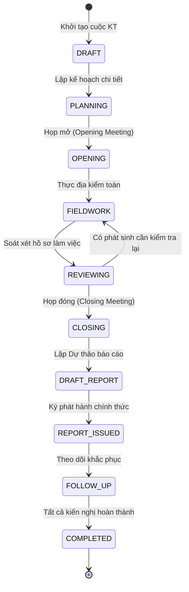
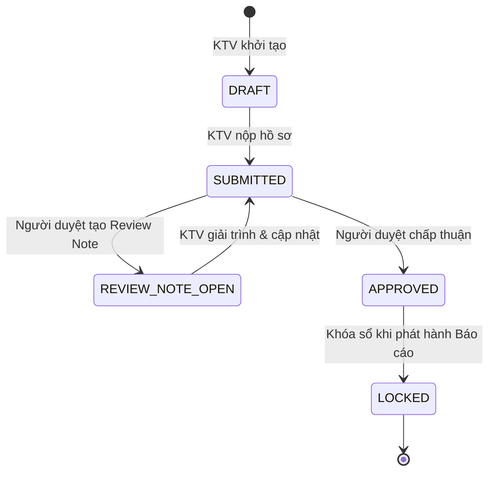
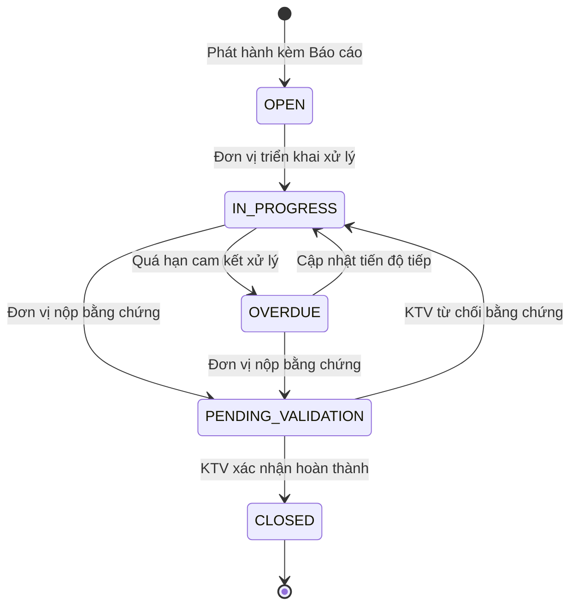

# TÀI LIỆU YÊU CẦU SẢN PHẨM (PRD)
## HỆ THỐNG PHẦN MỀM KIỂM TOÁN NỘI BỘ THẾ HỆ MỚI (KTNB 4.0)

**Mã tài liệu**: `KTNB-DOC-PRD`  
**Chuẩn mực áp dụng**: Agile Product Management, User-Centered Design, TeamMate+ Functional Benchmark  
**Phiên bản**: 4.0.0  
**Tình trạng**: Ban hành chính thức  
**Đơn vị quản lý sản phẩm**: Khối Quản lý Sản phẩm Công nghệ & Nghiệp vụ KTNB  

---

## 1. TẦM NHÌN & ĐỊNH VỊ SẢN PHẨM

### 1.1. Tuyên Bố Tầm Nhìn Sản Phẩm (Product Vision Statement)
> *"Dành cho Khối Kiểm toán Nội bộ và Ban Kiểm soát của các Ngân hàng thương mại tại Việt Nam, **KTNB 4.0** là nền tảng quản trị kiểm toán và tuân thủ rủi ro toàn diện thế hệ mới. Khác với các phần mềm ngoại nhập đắt đỏ và cồng kềnh như TeamMate+ hay MetricStream, KTNB 4.0 được may đo hoàn hảo theo **Thông tư 13/2018/TT-NHNN** và chuẩn mực **IIA GIAS 2024**, ứng dụng công nghệ hiện đại (NestJS Fastify + PostgreSQL + React SPA), tự động hóa toàn bộ vòng đời kiểm toán từ đánh giá rủi ro, thực địa, lập báo cáo đến giám sát khắc phục kiến nghị theo thời gian thực."*

### 1.2. Trụ Cột Giá Trị Cốt Lõi (Core Value Pillars)
1. **Tuân thủ Chuẩn mực & Luật định**: Bám sát 100% Thông tư 13/2018/TT-NHNN, Thông tư 11/2021/TT-NHNN, Thông tư 39/2016/TT-NHNN và IIA GIAS.
2. **Trải nghiệm Người dùng Xuất sắc (User-Centric UX)**: Giao diện trực quan tiếng Việt, đồ họa Heatmap tương tác, bảng tính kiểm toán thông minh, giảm 50% thao tác nhập liệu rườm rà.
3. **Cộng tác Thời gian Thực & Soát xét Đa cấp**: Cơ chế Review Notes linh hoạt, phản hồi tức thì giữa KTV lập và cấp soát xét.
4. **Phân tích Dữ liệu Kiểm toán Chuyên sâu (CAATs)**: Tự động trích xuất mẫu dữ liệu Core Banking, phát hiện tức thì các giao dịch bất thường và rủi ro gian lận.

---

## 2. CHÂN DUNG NGƯỜI DÙNG (USER PERSONAS)

```
┌──────────────────────────────────────┐     ┌──────────────────────────────────────┐
│ Persona 1: NGUYỄN VĂN AN             │     │ Persona 2: TRẦN THỊ MAI              │
│ Vai trò: Trưởng ban KTNB (CAE)       │     │ Vai trò: Trưởng đoàn Kiểm toán       │
│ Nhu cầu: Phê duyệt Kế hoạch năm,     │     │ Nhu cầu: Điều phối thực địa, soát xét│
│ theo dõi tiến độ toàn ngân hàng,     │     │ hồ sơ, tạo Review Notes, chốt 5C,    │
│ ký duyệt Báo cáo chính thức.         │     │ tổ chức họp mở và họp đóng.          │
└──────────────────────────────────────┘     └──────────────────────────────────────┘

┌──────────────────────────────────────┐     ┌──────────────────────────────────────┐
│ Persona 3: LÊ HOÀNG NAM              │     │ Persona 4: PHẠM QUỐC BẢO             │
│ Vai trò: Kiểm toán viên Chuyên nghiệp│     │ Vai trò: Giám đốc Chi nhánh (Auditee)│
│ Nhu cầu: Thực hiện bước kiểm tra RCM,│     │ Nhu cầu: Tiếp nhận phát hiện, giải   │
│ lập Workpaper, tải bằng chứng băm    │     │ trình trực tuyến, phân công khắc phục│
│ SHA-256, ghi nhận phát hiện 5C.      │     │ và nộp tài liệu đóng kiến nghị.      │
└──────────────────────────────────────┘     └──────────────────────────────────────┘
```

---

## 3. DANH MỤC EPICS & USER STORIES CHI TIẾT

Hệ thống bao gồm **7 Epics nghiệp vụ cốt lõi**, tương ứng với **72 màn hình giao diện** hiện hữu trên Frontend:

### EPIC 1: Quản Trị Vũ Trụ Kiểm Toán & Ma Trận Rủi Ro (Audit Universe & RCM)
*Bao gồm các trang: `AuditUniverse.tsx`, `Departments.tsx`, `RiskCriteria.tsx`, `RiskAssessment.tsx`, `RiskControlMatrix.tsx`, `RiskRegister.tsx`.*

#### User Story 1.1: Thiết lập Danh mục Vũ trụ Kiểm toán Đa cấp
* **Là một**: Quản trị viên hệ thống hoặc Trưởng phòng KTNB,
* **Tôi muốn**: Thiết lập cấu trúc cây phân cấp các đối tượng kiểm toán (Khối, Phòng ban, Chi nhánh, Phòng giao dịch, Hệ thống CNTT),
* **Để**: Xác định phạm vi kiểm toán toàn diện không bỏ sót đối tượng nào trong ngân hàng.
* **Tiêu chí nghiệm thu (Acceptance Criteria)**:
  * **Given**: Người dùng có quyền `MANAGE_UNIVERSE`,
  * **When**: Nhập thông tin đối tượng kiểm toán mới kèm mã định danh, cấp cha con, người đại diện và phân loại nghiệp vụ,
  * **Then**: Hệ thống lưu trữ thành công và hiển thị đối tượng trên cây cấu trúc phân cấp; kiểm tra trùng lặp mã đối tượng.

#### User Story 1.2: Đánh giá Rủi ro Định lượng & Lập Ma trận Heatmap
* **Là một**: Kiểm toán viên hoặc Trưởng phòng KTNB,
* **Tôi muốn**: Chấm điểm rủi ro cho từng đối tượng theo tiêu chí Khả năng xảy ra (Likelihood 1-5) và Mức độ tác động (Impact 1-5),
* **Để**: Hệ thống tự động tính điểm Rủi ro Cố hữu, Rủi ro Còn lại và trực quan hóa lên Ma trận nhiệt Heatmap (Đỏ, Vàng, Xanh).
* **Tiêu chí nghiệm thu**:
  * **Given**: Đối tượng kiểm toán đã được gán các tiêu chí rủi ro tài chính, pháp lý và vận hành,
  * **When**: Người dùng nhập điểm đánh giá kiểm soát nội bộ (Control Effectiveness),
  * **Then**: Điểm Rủi ro Còn lại được tính theo công thức $\text{Residual Risk} = \text{Inherent Risk} \times (1 - \text{CE Factor})$, đối tượng tự động đổi màu tương ứng trên Risk Heatmap.

---

### EPIC 2: Lập Kế Hoạch Năm & Quản Lý Nguồn Lực (Annual Planning & Resources)
*Bao gồm các trang: `AuditPlan.tsx`, `ResourceCapacityView.tsx`, `ResourceCalendar.tsx`, `Personnel.tsx`, `Timesheet.tsx`.*

#### User Story 2.1: Lập Kế hoạch Kiểm toán Năm (AAP)
* **Là một**: Trưởng ban KTNB,
* **Tôi muốn**: Lập danh sách các cuộc kiểm toán dự kiến trong năm tài chính dựa trên các đối tượng có điểm Rủi ro Cao và chu kỳ kiểm toán luật định,
* **Để**: Trình Ban Kiểm soát phê duyệt trước ngày 15/12 hàng năm theo Thông tư 13/2018/TT-NHNN.
* **Tiêu chí nghiệm thu**:
  * **Given**: Danh sách đối tượng có điểm rủi ro High và Medium,
  * **When**: Chọn "Tạo Kế hoạch năm", chọn năm tài chính và bổ sung các cuộc kiểm toán định kỳ,
  * **Then**: Hệ thống tổng hợp tổng số cuộc kiểm toán, tổng ngân sách ngày công (Man-days) và hỗ trợ gửi trình duyệt Ban Kiểm soát.

#### User Story 2.2: Ghi nhận Thời gian Làm việc (Timesheets)
* **Là một**: Kiểm toán viên,
* **Tôi muốn**: Ghi nhận số giờ làm việc thực tế hàng ngày theo từng cuộc kiểm toán hoặc công việc quản trị,
* **Để**: Hệ thống theo dõi định biên chi phí và đánh giá hiệu suất (KPI) KTV.
* **Tiêu chí nghiệm thu**:
  * **Given**: KTV được phân công vào cuộc kiểm toán KT-2026-01,
  * **When**: Nhập số giờ làm việc trong ngày (tối đa 8h tiêu chuẩn + OT nếu có), chọn mã công việc và bấm nộp,
  * **Then**: Trưởng đoàn nhận được thông báo để phê duyệt giờ công, hệ thống cập nhật tiến độ ngân sách giờ công của cuộc kiểm toán.

---

### EPIC 3: Thực Hiện Kiểm Toán & Hồ Sơ Làm Việc Điện Tử (Fieldwork & Workpapers)
*Bao gồm các trang: `AuditEngagements.tsx`, `AuditPrograms.tsx`, `WorkingPapers.tsx`, `Evidences.tsx`, `QualityControl.tsx`, `MasterSamplingTab.tsx`.*

#### User Story 3.1: Soạn thảo Hồ sơ Làm việc Điện tử (Workpapers)
* **Là một**: Kiểm toán viên được phân công,
* **Tôi muốn**: Thực hiện các bước kiểm tra theo chương trình kiểm toán, nhập kết luận ToD (Thiết kế) và ToE (Vận hành), đính kèm bằng chứng kiểm toán,
* **Để**: Lưu trữ đầy đủ tài liệu minh chứng cho các kết luận kiểm toán.
* **Tiêu chí nghiệm thu**:
  * **Given**: Hồ sơ làm việc ở trạng thái `IN_PROGRESS`,
  * **When**: KTV nhập diễn giải các mẫu kiểm tra, tải lên file bằng chứng kiểm toán (PDF, Excel, Ảnh),
  * **Then**: Hệ thống tự động tính toán mã băm SHA-256 của file bằng chứng, lưu vết người tải và thời gian, đổi trạng thái hồ sơ sang `SUBMITTED` để chờ duyệt.

#### User Story 3.2: Tạo & Phản hồi Điểm Soát Xét (Review Notes)
* **Là một**: Trưởng đoàn kiểm toán hoặc Người soát xét,
* **Tôi muốn**: Tạo các điểm soát xét (Review Notes) trực tiếp trên từng mục của hồ sơ làm việc,
* **Để**: Yêu cầu KTV giải trình bổ sung hoặc làm rõ bằng chứng trước khi ký duyệt.
* **Tiêu chí nghiệm thu**:
  * **Given**: Hồ sơ làm việc ở trạng thái `SUBMITTED`,
  * **When**: Trưởng đoàn đánh dấu đoạn nội dung cần làm rõ, nhập ghi chú yêu cầu giải trình và chọn "Tạo Review Note",
  * **Then**: Hồ sơ chuyển sang trạng thái `REVIEW_NOTE_OPEN`, KTV nhận được thông báo giải trình, hồ sơ không thể được phê duyệt (`Sign-off`) cho đến khi toàn bộ Review Notes được giải quyết (`Cleared`).

---

### EPIC 4: Quản Lý Phát Hiện 5C & Kết Xuất Báo Cáo Tự Động (Findings & Reports)
*Bao gồm các trang: `AuditFindings.tsx`, `AuditReports.tsx`, `AuditMinutesPage.tsx`, `AuditRatingView.tsx`.*

#### User Story 4.1: Nhập Phát hiện Kiểm toán theo Chuẩn 5C
* **Là một**: Kiểm toán viên,
* **Tôi muốn**: Nhập phát hiện kiểm toán bắt buộc tuân theo 5 thành tố: Thực trạng (Condition), Tiêu chuẩn (Criteria), Nguyên nhân (Cause), Hậu quả (Consequence), và Kiến nghị (Corrective Action),
* **Để**: Đảm bảo chất lượng phát hiện kiểm toán đạt chuẩn quốc tế IIA và thuyết phục đối với đơn vị được kiểm toán.
* **Tiêu chí nghiệm thu**:
  * **Given**: Màn hình tạo phát hiện kiểm toán mới,
  * **When**: KTV nhập đầy đủ 5 trường 5C, chọn mức độ rủi ro (Critical/High/Medium/Low), gắn thẻ nghiệp vụ (Tín dụng, Kế toán, CNTT),
  * **Then**: Hệ thống kiểm tra tính đầy đủ (Validation), lưu phát hiện và tự động tạo dự thảo kiến nghị tương ứng.

#### User Story 4.2: Tự động Xuất Báo cáo KTNB Chuẩn Định dạng Word/PDF
* **Là một**: Trưởng đoàn kiểm toán,
* **Tôi muốn**: Xuất toàn bộ nội dung cuộc kiểm toán thành Báo cáo Kiểm toán Nội bộ định dạng `.docx` và `.pdf`,
* **Để**: Trình Ban Giám đốc Khối KTNB và Ban Kiểm soát ký ban hành chính thức.
* **Tiêu chí nghiệm thu**:
  * **Given**: Cuộc kiểm toán đã hoàn thành giai đoạn họp đóng và chốt ý kiến giải trình,
  * **When**: Chọn "Kết xuất Báo cáo KTNB", chọn mẫu biểu báo cáo của Ban Kiểm soát,
  * **Then**: Hệ thống tự động điền toàn bộ tóm tắt điều hành, ma trận xếp hạng rủi ro, danh sách phát hiện 5C và cam kết khắc phục thành file Word chuẩn thể thức văn bản hành chính ngân hàng.

---

### EPIC 5: Cổng Tương Tác Đơn Vị & Theo Dõi Khắc Phục (Auditee Portal & Remediation)
*Bao gồm các trang: `AuditeePortal.tsx`, `Recommendations.tsx`, `SummaryReports.tsx`.*

#### User Story 5.1: Tiếp nhận Kiến nghị & Nộp Bằng chứng Khắc phục
* **Là một**: Đầu mối đơn vị được kiểm toán (Auditee Lead),
* **Tôi muốn**: Truy cập Cổng Auditee Portal để xem danh sách các kiến nghị thuộc đơn vị mình, cập nhật tiến độ (%) và nộp file bằng chứng hoàn thành,
* **Để**: Minh bạch hóa quá trình khắc phục kiến nghị theo cam kết với Ban Kiểm soát.
* **Tiêu chí nghiệm thu**:
  * **Given**: Kiến nghị ở trạng thái `IN_PROGRESS`,
  * **When**: Auditee tải lên quyết định sửa đổi quy trình, ảnh chụp chứng từ khắc phục và bấm "Yêu cầu Đóng kiến nghị",
  * **Then**: Kiến nghị chuyển sang trạng thái `PENDING_VALIDATION`, KTV phụ trách nhận thông báo thẩm định.

#### User Story 5.2: Thẩm định Bằng chứng & Đóng Kiến nghị
* **Là một**: Kiểm toán viên theo dõi kiến nghị,
* **Tôi muốn**: Kiểm tra tài liệu chứng minh do Auditee gửi lên để quyết định Đóng hoàn thành hoặc Yêu cầu khắc phục tiếp,
* **Để**: Đảm bảo các kiến nghị kiểm toán được khắc phục triệt để trên thực tế, không đóng hình thức.
* **Tiêu chí nghiệm thu**:
  * **Given**: Kiến nghị ở trạng thái `PENDING_VALIDATION`,
  * **When**: KTV đánh giá bằng chứng đạt yêu cầu và chọn "Xác nhận Đóng",
  * **Then**: Trạng thái chuyển thành `CLOSED`, hệ thống ghi nhận ngày đóng thực tế, đối chiếu với hạn cam kết để tính tỷ lệ hoàn thành đúng hạn (On-time SLA).

---

### EPIC 6: Giám Sát Liên Tục & Phân Tích Dữ Liệu (Continuous Auditing & CAATs)
*Bao gồm các trang: `ContinuousMonitoring.tsx`, `DataAnalytics.tsx`, `ExternalDatabaseConnections.tsx`.*

#### User Story 6.1: Cảnh báo Tự động Giao dịch Cho Vay Đảo Nợ
* **Là một**: Kiểm toán viên chuyên trách phân tích dữ liệu,
* **Tôi muốn**: Hệ thống tự động chạy kịch bản SQL quét các giao dịch giải ngân và thu nợ trong vòng 48 giờ của cùng một khách hàng trên Core Banking,
* **Để**: Phát hiện các dấu hiệu cho vay đảo nợ (Evergreening) che giấu nợ quá hạn.
* **Tiêu chí nghiệm thu**:
  * **Given**: Dữ liệu giao dịch Core Banking được nạp định kỳ hàng ngày,
  * **When**: Job giám sát liên tục chạy lúc 02:00 sáng,
  * **Then**: Các bản ghi thỏa mãn điều kiện đảo nợ được tạo thành Cảnh báo (Alert) trên trang `ContinuousMonitoring.tsx` với mức độ ưu tiên `HIGH`.

---

### EPIC 7: Cổng Ban Kiểm Soát & Bảng Điều Khiển Cấp Cao (Audit Committee Portal)
*Bao gồm các trang: `AuditCommitteePortal.tsx`, `Dashboard.tsx`, `FindingsAnalytics.tsx`, `ExecutionDashboard.tsx`.*

#### User Story 7.1: Bảng Điều Khiển Rủi Ro & Tiến Độ Toàn Hàng
* **Là một**: Thành viên Ban Kiểm soát / Hội đồng Quản trị,
* **Tôi muốn**: Truy cập Dashboard điều hành để xem Heatmap rủi ro toàn hàng, tỷ lệ hoàn thành kế hoạch kiểm toán năm và số lượng kiến nghị quá hạn phân bổ theo Khối,
* **Để**: Nắm bắt tức thì bức tranh kiểm soát nội bộ và chỉ đạo kịp thời Ban Điều hành ngân hàng.
* **Tiêu chí nghiệm thu**:
  * **Given**: Người dùng có vai trò `AUDIT_COMMITTEE` hoặc `CAE`,
  * **When**: Mở trang `AuditCommitteePortal.tsx`,
  * **Then**: Hệ thống hiển thị các widget biểu đồ động: Tiến độ AAP (%), Số lượng phát hiện Critical/High chưa xử lý, Top 5 Chi nhánh có số lượng kiến nghị quá hạn cao nhất.

---

## 4. BIỂU ĐỒ TRẠNG THÁI VẬN HÀNH NGHIỆP VỤ (STATE MACHINES)

### 4.1. Vòng Đời Cuộc Kiểm Toán (Engagement Lifecycle)


### 4.2. Vòng Đời Hồ Sơ Làm Việc & Điểm Soát Xét (Workpaper & Review Notes)


### 4.3. Vòng Đời Kiến Nghị Kiểm Toán (Recommendation Lifecycle)


---

## 5. LỘ TRÌNH PHÁT HÀNH (RELEASE ROADMAP)

| Giai đoạn | Phiên bản | Phạm vi phát hành | Mục tiêu nghiệp vụ đạt được |
|---|---|---|---|
| **Phase 1: Core Foundation** | v1.0 - v2.0 | Quản trị Vũ trụ kiểm toán, Quản lý Cuộc kiểm toán, Hồ sơ làm việc điện tử (Workpapers), Phát hiện 5C | Thay thế 100% hồ sơ giấy, chuẩn hóa quy trình làm việc KTV. |
| **Phase 2: Full Governance** | v3.0 - v3.5 | Lập kế hoạch năm (AAP), Cổng Auditee Portal, Theo dõi kiến nghị, Báo cáo tự động | Kết nối thông suốt Tuyến 3 và Tuyến 1, giảm 50% kiến nghị quá hạn. |
| **Phase 3: Smart Audit 4.0** | v4.0 (Hiện tại) | Giám sát liên tục (CAATs Core Banking), Cổng Ban Kiểm soát, CASL ABAC, Audit Trail bất biến | Nền tảng kiểm toán thông minh, phân tích dữ liệu lớn, an toàn Cấp độ 3. |
