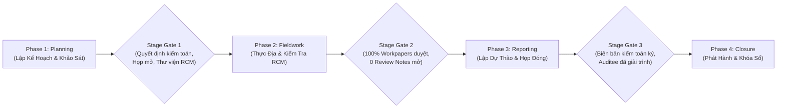

# ĐẶC TẢ CHI TIẾT MÀN HÌNH & TÍNH NĂNG: THỰC ĐỊA CUỘC KIỂM TOÁN & HỒ SƠ ĐIỆN TỬ (PHẦN 4)
## HỆ THỐNG PHẦN MỀM KIỂM TOÁN NỘI BỘ THẾ HỆ MỚI (KTNB 4.0)

**Mã tài liệu**: `KTNB-SCREEN-04`  
**Căn cứ mã nguồn**: `frontend/src/pages/AuditEngagements.tsx`, `AuditPrograms.tsx`, `WorkingPapers.tsx`, `TestOfControl.tsx`, `MasterSamplingTab.tsx`, `DetailedSamplingGrid.tsx`, `SampleTestingDrawer.tsx`, `Evidences.tsx`, `QualityControl.tsx`, `AuditMinutesPage.tsx`  
**Phiên bản**: 4.0.0  

---

## 1. MÀN HÌNH: QUẢN LÝ VÒNG ĐỜI CUỘC KIỂM TOÁN (`AuditEngagements.tsx`)

### 1.1. Mục Đích & Vai Trò Người Dùng
* **Đường dẫn Route**: `/audit-engagements`
* **File mã nguồn**: [frontend/src/pages/AuditEngagements.tsx](file:///f:/Phan%20mem%20KTNB%204.0/frontend/src/pages/AuditEngagements.tsx) (1.165 dòng mã)
* **Đối tượng sử dụng**: Trưởng đoàn kiểm toán, Phó đoàn, Thành viên đoàn kiểm toán, Trưởng phòng KTNB.
* **Vai trò**: Trung tâm chỉ huy (Command Center) của toàn bộ cuộc kiểm toán tại thực địa. Quản lý nghiêm ngặt quy trình 4 giai đoạn tuần tự (**Strict Sequential Stage-Gating**), ngăn chặn hoàn toàn việc đốt cháy giai đoạn.

### 1.2. Cơ Chế Kiểm Soát 4 Giai Đoạn Nghiêm Ngặt (Strict Sequential Stage-Gating)

Hệ thống bắt buộc cuộc kiểm toán phải hoàn thành 100% điều kiện tiên quyết tại từng giai đoạn trước khi được phép chuyển sang giai đoạn tiếp theo (thông qua `StageGateModal`):

1. **Phase 1: Planning Tab (`Phase1PlanningTab.tsx`)**:
   * Khảo sát ban đầu thông tin Chi nhánh/Đơn vị (Dư nợ tín dụng, huy động vốn, tỷ lệ nợ xấu, cơ cấu nhân sự).
   * Lập và ban hành Quyết định kiểm toán chính thức (kèm phân công Trưởng đoàn và các thành viên).
   * Tổ chức Họp mở (Opening Meeting), ký Biên bản họp mở với Ban Giám đốc đơn vị được kiểm toán.
   * Sao chép và hoàn thiện Thư viện Ma trận RCM cho cuộc kiểm toán (`EngagementRcmModal`).
   * **Điều kiện qua Gate 1**: Quyết định kiểm toán đã ban hành + Biên bản họp mở đã ký + Danh mục RCM đã được Trưởng phòng phê duyệt.
2. **Phase 2: Fieldwork Tab (`Phase2FieldworkTab.tsx`)**:
   * Triển khai các luồng công việc kiểm toán (`AuditWorkstreamModal`).
   * Phân chia và quản lý các tác vụ thực địa (`EngagementTaskModal`) qua bảng Kanban Board kéo thả (`@hello-pangea/dnd`): `Todo` -> `InProgress` -> `Review` -> `Done`.
   * Thực hiện chọn mẫu dữ liệu giao dịch (`MasterSamplingTab`).
   * Thực hiện kiểm tra hồ sơ làm việc (Workpapers), thử nghiệm kiểm soát ToD & ToE.
   * **Điều kiện qua Gate 2**: 100% hồ sơ làm việc đã được ký duyệt (`Approved`) + Toàn bộ Review Notes đã được KTV giải trình và người tạo bấm `Cleared`.
3. **Phase 3: Reporting Tab (`Phase3ReportingTab.tsx`)**:
   * Tập hợp danh sách các phát hiện kiểm toán chuẩn 5C.
   * Tổ chức Họp đóng (Closing Meeting) với đơn vị được kiểm toán, ký Biên bản họp đóng.
   * Nhận ý kiến phản hồi giải trình chính thức của đơn vị được kiểm toán (`Auditee Feedback`).
   * Soạn thảo Dự thảo Báo cáo Kiểm toán Nội bộ (`Draft Audit Report`).
   * **Điều kiện qua Gate 3**: Biên bản họp đóng đã ký kèm file scan + Auditee đã ký xác nhận biên bản hoặc có văn bản giải trình.
4. **Phase 4: Closure Tab (`Phase4ClosureTab.tsx`)**:
   * Trình Trưởng ban KTNB và Ban Kiểm soát ký ban hành Báo cáo chính thức (`OfficializeModal`).
   * Hệ thống tự động kích hoạt cờ **Khóa Sổ Kiểm Toán (`is_locked = true`)**.
   * Chuyển toàn bộ các phát hiện đã duyệt sang phân hệ Theo dõi kiến nghị (`RecommendationsModule`).
   * Đóng gói và lưu trữ hồ sơ tài liệu cuộc kiểm toán vào kho lưu trữ số (`EngagementDossierManager`).

### 1.3. Bảng Quản Lý Danh Sách & Băng Rôn Thông Tin (UI Details)
* **EngagementHeaderBanner**: Hiển thị trên đầu trang khi chọn một cuộc kiểm toán: Mã cuộc kiểm toán, Tên đơn vị, Trưởng đoàn, Khoảng thời gian kiểm toán, Thanh quy trình 4 Phase (`AuditEngagementProcessBar`), Nút "Chuyển Giai Đoạn (Stage Gate Action)".
* **EngagementChangeRequests**: Màn hình quản lý các yêu cầu thay đổi phạm vi kiểm toán, gia hạn thời gian kiểm toán thực địa hoặc bổ sung thành viên đoàn kiểm toán (phải được Trưởng phòng phê duyệt).

---

## 2. MÀN HÌNH: HỒ SƠ LÀM VIỆC ĐIỆN TỬ (`WorkingPapers.tsx`)

### 2.1. Mục Đích & Vai Trò Người Dùng
* **Đường dẫn Route**: `/working-papers`
* **File mã nguồn**: [frontend/src/pages/WorkingPapers.tsx](file:///f:/Phan%20mem%20KTNB%204.0/frontend/src/pages/WorkingPapers.tsx) (854 dòng mã)
* **Đối tượng sử dụng**: Kiểm toán viên lập hồ sơ, Người soát xét (Reviewer), Trưởng đoàn ký duyệt.
* **Vai trò**: Cung cấp môi trường soạn thảo hồ sơ kiểm toán điện tử thay thế hoàn toàn giấy tờ làm việc truyền thống. Tích hợp ma trận kiểm toán tín dụng chuyên sâu và ma trận khắc phục kiến nghị PTD.

### 2.2. Ba Phân Hệ Làm Việc Cốt Lõi (Three Main Tabs)
1. **Tab 1: Danh Sách Giấy Tờ Làm Việc Chung (`list`)**:
   * Bảng hiển thị danh sách hồ sơ: Mã hồ sơ (WP Code), Tiêu đề bước kiểm tra, KTV thực hiện, Người soát xét, Trạng thái (`Bản nháp`, `Chờ duyệt`, `Yêu cầu sửa`, `Đã phê duyệt`).
   * Bộ lọc phạm vi: `Tất cả hồ sơ (all)` hoặc `Chỉ hồ sơ của tôi (my)`.
   * Thao tác: "Mở Drawer Soạn Thảo Chi Tiết", "Xuất Excel", "Import Excel", "Đồng Bộ Offline (`isSyncModalVisible`)".
2. **Tab 2: Ma Trận Kiểm Toán Tín Dụng Ngân Hàng (`CreditWorkingPaperGrid.tsx`)**:
   * Chuyên biệt cho nghiệp vụ kiểm toán Tín dụng KHDN và Bán lẻ.
   * Lưới dữ liệu bảng tính thông minh kiểm tra chi tiết theo từng hợp đồng tín dụng:
     - Số CIF, Tên khách hàng vay vốn.
     - Hạn mức tín dụng phê duyệt vs Dư nợ thực tế.
     - Mục đích vay vốn theo phương án kinh doanh.
     - Kết quả kiểm tra hồ sơ pháp lý & năng lực tài chính.
     - Kiểm tra tài sản bảo đảm (TSBĐ): Biên bản định giá, Đăng ký giao dịch bảo đảm, Mua bảo hiểm TSBĐ.
     - Kiểm tra giải ngân & kiểm soát sau vay: Chứng từ thanh toán bên thụ hưởng, Biên bản kiểm tra sử dụng vốn vay định kỳ.
     - Phân loại nhóm nợ theo Thông tư 11/2021/TT-NHNN: Nhóm 1 (Đủ tiêu chuẩn), Nhóm 2 (Cần chú ý), Nhóm 3 (Dưới tiêu chuẩn), Nhóm 4 (Nghi ngờ), Nhóm 5 (Có khả năng mất vốn).
3. **Tab 3: Ma Trận Khắc Phục Kiến Nghị PTD (`PTDRemediationGrid.tsx`)**:
   * Kiểm tra việc khắc phục các tồn tại, kiến nghị của các đợt kiểm tra trước đó hoặc của cơ quan Thanh tra Giám sát NHNN.

### 2.3. Drawer Soạn Thảo Chi Tiết (`WorkingPaperDetailDrawer.tsx`)
Khi KTV nhấp vào một hồ sơ làm việc, Drawer trượt ra từ bên phải màn hình hiển thị đầy đủ các trường nghiệp vụ:
* **Mục tiêu kiểm tra (Audit Objective)**: Căn cứ theo quy định tại văn bản nào.
* **Thử nghiệm Thiết kế (Test of Design - ToD)**: Đánh giá quy trình có chặt chẽ và phòng ngừa được rủi ro không.
* **Thử nghiệm Vận hành (Test of Operating Effectiveness - ToE)**: Đánh giá quy trình có được thực thi nghiêm túc trong thực tế không.
* **Tổng thể mẫu kiểm tra**: Quy mô mẫu ($n$), Phương pháp chọn mẫu, Số lượng mẫu sai lệch, Tỷ lệ sai lệch (%).
* **Đính kèm Bằng chứng kiểm toán**: Upload file đính kèm kèm hiển thị mã băm SHA-256 xác thực.
* **Khu vực Review Notes**: Xem các câu hỏi soát xét của Trưởng đoàn, nhập nội dung giải trình và cập nhật lại hồ sơ.
* **Nút "Nộp Duyệt (Submit for Review)"**: Chuyển trạng thái sang `SUBMITTED`, gửi thông báo đến Người soát xét.

---

## 3. MÀN HÌNH: CÔNG CỤ CHỌN MẪU KIỂM TOÁN (`MasterSamplingTab.tsx`, `DetailedSamplingGrid.tsx`)

### 3.1. Mục Đích & Vai Trò Người Dùng
* **File mã nguồn**: [frontend/src/pages/MasterSamplingTab.tsx](file:///f:/Phan%20mem%20KTNB%204.0/frontend/src/pages/MasterSamplingTab.tsx), [DetailedSamplingGrid.tsx](file:///f:/Phan%20mem%20KTNB%204.0/frontend/src/pages/DetailedSamplingGrid.tsx)
* **Đối tượng sử dụng**: KTV thực hiện kiểm tra chi tiết.
* **Vai trò**: Cung cấp công cụ toán học thống kê chọn mẫu kiểm toán khoa học theo chuẩn mực quốc tế, hỗ trợ lấy mẫu theo đơn vị tiền tệ (MUS), lấy mẫu thuộc tính (Attribute Sampling) và lấy mẫu phân tầng (Stratified Sampling).

### 3.2. Tính Năng & Công Thức Chọn Mẫu
1. **Lấy Mẫu Theo Đơn Vị Tiền Tệ (Monetary Unit Sampling - MUS)**:
   * Ứng dụng cho kiểm toán danh mục dư nợ cho vay và số dư tiền gửi.
   * Nhập các tham số đầu vào:
     - Tổng giá trị tổng thể danh mục ($BV$ - Book Value).
     - Mức sai sót chấp nhận được ($TM$ - Tolerable Misstatement, ví dụ: 2% tổng dư nợ).
     - Mức độ tin cậy mong muốn ($CL$ - Confidence Level, ví dụ: 95%).
     - Hệ số rủi ro kiểm soát ($RF$ - Risk Factor).
   * Hệ thống tự động tính toán:
     $$\text{Khoảng Cách Mẫu (Sampling Interval } J) = \frac{TM}{RF}$$
     $$\text{Cỡ Mẫu Dự Kiến } (n) = \frac{BV}{J}$$
2. **Lưới Hiển Thị Các Mẫu Được Chọn (`DetailedSamplingGrid`)**:
   * Tự động trích xuất các hợp đồng thỏa mãn khoảng cách mẫu vào lưới.
   * Cho phép KTV mở `SampleTestingDrawer.tsx` để thực hiện kiểm tra từng mẫu đơn lẻ và nhập kết quả kiểm tra đạt (`Pass`) hoặc không đạt (`Fail`).

---

## 4. MÀN HÌNH: SOÁT XÉT CHẤT LƯỢNG & REVIEW NOTES (`QualityControl.tsx`)

### 4.1. Mục Đích & Vai Trò Người Dùng
* **Đường dẫn Route**: `/quality-control`
* **File mã nguồn**: [frontend/src/pages/QualityControl.tsx](file:///f:/Phan%20mem%20KTNB%204.0/frontend/src/pages/QualityControl.tsx)
* **Đối tượng sử dụng**: Trưởng đoàn kiểm toán, Người soát xét cấp 1, Trưởng phòng KTNB.
* **Vai trò**: Quản trị chất lượng hồ sơ kiểm toán theo chuẩn mực **IIA GIAS Standard 11.2 (Review of Work)**. Đảm bảo toàn bộ bằng chứng kiểm toán thu thập là đầy đủ, thích hợp và có căn cứ xác thực trước khi phát hành phát hiện và báo cáo.

### 4.2. Thành Phần Giao Diện & Tính Năng Chi Tiết
1. **Bảng Theo Dõi Điểm Soát Xét (Review Notes Tracking Matrix)**:
   * Cột 1: Mã Review Note & Hồ sơ làm việc liên quan.
   * Cột 2: Nội dung câu hỏi soát xét của Trưởng đoàn: *"Đề nghị KTV bổ sung biên bản kiểm tra thực địa tài sản bảo đảm của khoản vay 50 tỷ của Công ty X"*.
   * Cột 3: Người lập câu hỏi (Reviewer) & Người phải giải trình (Auditor Assignee).
   * Cột 4: Nội dung giải trình của KTV: *"Đã bổ sung file biên bản kiểm tra ngày 15/03 tại mục bằng chứng số 04"*.
   * Cột 5: Trạng thái Review Note:
     - `Open` (Đang chờ KTV xử lý - Màu đỏ).
     - `Responded` (KTV đã giải trình, chờ Người soát xét nghiệm thu - Màu vàng).
     - `Cleared` (Người soát xét chấp thuận giải trình, đóng điểm soát xét - Màu xanh lá).
2. **Quy Tắc Khóa Phê Duyệt Hồ Sơ (Approval Blocking Rule)**:
   * Hệ thống kiên quyết chặn không cho phép Trưởng đoàn bấm nút "Phê Duyệt Cuộc Kiểm Toán" nếu vẫn còn ít nhất **01 Review Note ở trạng thái `Open` hoặc `Responded`**.

---

## 5. MÀN HÌNH: BIÊN BẢN LÀM VIỆC KIỂM TOÁN (`AuditMinutesPage.tsx`, `AuditMinutesTab.tsx`)

### 5.1. Mục Đích & Vai Trò Người Dùng
* **Đường dẫn Route**: `/audit-minutes`
* **File mã nguồn**: [frontend/src/pages/AuditMinutesPage.tsx](file:///f:/Phan%20mem%20KTNB%204.0/frontend/src/pages/AuditMinutesPage.tsx), [AuditMinutesTab.tsx](file:///f:/Phan%20mem%20KTNB%204.0/frontend/src/pages/AuditMinutesTab.tsx)
* **Đối tượng sử dụng**: Trưởng đoàn, KTV, Đại diện đơn vị được kiểm toán.
* **Vai trò**: Soạn thảo, lấy ý kiến xác nhận và ký Biên bản làm việc kiểm toán tại thực địa (Biên bản họp mở, Biên bản kiểm toán từng mảng nghiệp vụ, Biên bản họp đóng).

### 5.2. Tính Năng & Quy Trình Ký Duyệt
1. **Soạn Thảo Biên Bản Trực Tuyến**:
   * Hệ thống tự động kéo toàn bộ danh sách các phát hiện sơ bộ và số liệu kiểm tra vào nội dung biên bản.
   * Biên tập nội dung thành phần tham dự, thời gian, địa điểm làm việc.
2. **Ký Số & Nạp Bản Ký (Digital Sign & Upload Scan)**:
   * Cho phép ký số trực tuyến hoặc in biên bản để ký tay, sau đó tải file scan có dấu đỏ của Giám đốc Chi nhánh lên hệ thống làm căn cứ pháp lý chuyển sang Phase 3 (Reporting).
