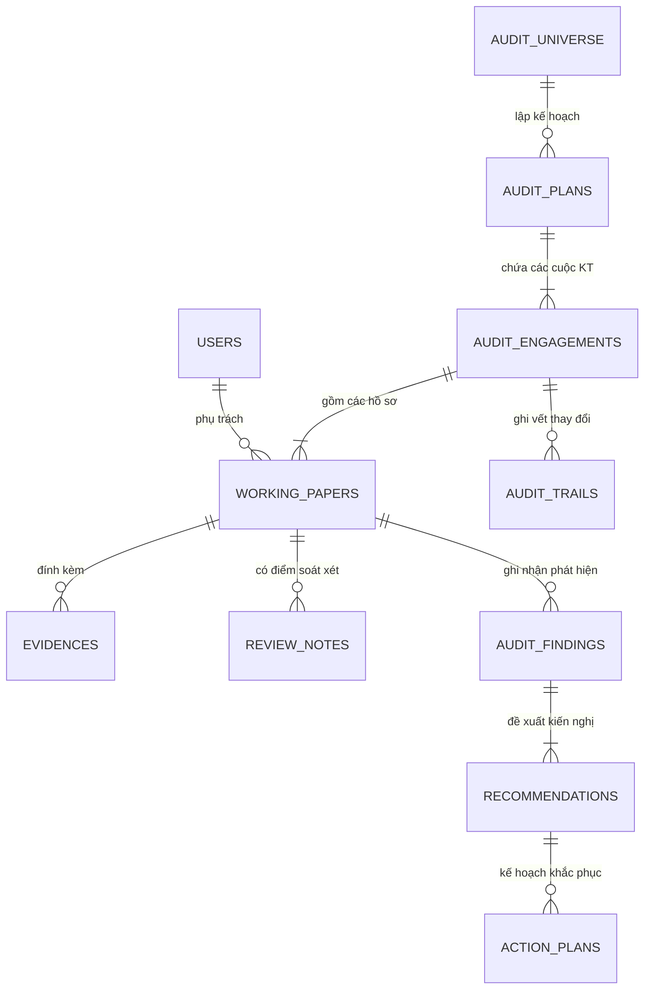

# ĐẶC TẢ YÊU CẦU PHẦN MỀM (SRS)
## HỆ THỐNG PHẦN MỀM KIỂM TOÁN NỘI BỘ THẾ HỆ MỚI (KTNB 4.0)

**Mã tài liệu**: `KTNB-DOC-SRS`  
**Chuẩn mực thiết kế**: IEEE Std 830-1998 / ISO/IEC/IEEE 29148:2018, PMBOK Systems Engineering  
**Phiên bản**: 4.0.0  
**Tình trạng**: Ban hành chính thức  
**Đơn vị phê duyệt kỹ thuật**: Khối Công nghệ Thông tin & Ban Dự án KTNB 4.0  

---

## 1. GIỚI THIỆU & PHẠM VI TÀI LIỆU

### 1.1. Mục Đích Tài Liệu
Tài liệu Đặc tả Yêu cầu Phần mềm (SRS) này xác định chi tiết các yêu cầu chức năng (Functional Requirements - FR), yêu cầu phi chức năng (Non-Functional Requirements - NFR), cấu trúc cơ sở dữ liệu và các giao diện kỹ thuật của **Hệ thống Phần mềm Kiểm toán Nội bộ KTNB 4.0**. Tài liệu đóng vai trò là hợp đồng kỹ thuật chuẩn mực giữa đội ngũ nghiệp vụ kiểm toán, kỹ sư phát triển phần mềm, kiểm thử viên (QA/QC) và cơ quan thẩm định an toàn bảo mật.

### 1.2. Phạm Vi Hệ Thống (System Scope)
Hệ thống KTNB 4.0 bao gồm:
* **Ứng dụng Web Phía Khách (Frontend SPA)**: Xây dựng trên React 18, TypeScript, Tailwind CSS, cung cấp 72 màn hình giao diện phục vụ các nhóm người dùng: KTV, Trưởng đoàn, Lãnh đạo KTNB, Auditee và Ban Kiểm soát.
* **Hệ thống Ứng dụng Phía Máy Chủ (Backend API)**: Xây dựng trên nền tảng NestJS 11 với động cơ Fastify tốc độ cao, bao gồm **69 modules nghiệp vụ**, cung cấp các dịch vụ RESTful API chuẩn hóa.
* **Tầng Cơ Sở Dữ Liệu (Database Tier)**: Sử dụng PostgreSQL 16+ với **112 bảng quan hệ**, hỗ trợ lưu trữ dữ liệu bán cấu trúc bằng JSONB và phân vùng bảng (Partitioning) cho các bảng lịch sử kiểm toán.

---

## 2. MÔ TẢ TỔNG QUAN HỆ THỐNG

### 2.1. Môi Trường Vận Hành (Operating Environment)
* **Máy chủ Ứng dụng Backend**: Node.js v20+ LTS, NestJS 11, Fastify v5, quản lý tiến trình bằng PM2 hoặc Docker Container trên hệ điều hành Linux (RHEL / Ubuntu Server) hoặc Windows Server.
* **Máy chủ Cơ sở dữ liệu**: PostgreSQL 16+ (hỗ trợ pg_stat_statements, pgcrypto, uuid-ossp).
* **Môi trường Trình duyệt Phía Khách**: Google Chrome (v90+), Microsoft Edge Chromium (v90+), Mozilla Firefox (v88+), Safari (v14+).

### 2.2. Các Ràng Buộc Thiết Kế & Thực Hiện (Design Constraints)
1. **Kiến trúc Không Lưu Trạng Thái (Stateless Architecture)**: Backend API hoạt động hoàn toàn stateless, phiên làm việc được duy trì qua JWT (JSON Web Token) có chữ ký số bí mật, sẵn sàng cho việc mở rộng theo chiều ngang (Horizontal Scaling).
2. **Tuân thủ Chuẩn Mực Báo Cáo Ngân Hàng**: Các báo cáo kết xuất định dạng Word/Excel phải đáp ứng quy định về thể thức văn bản hành chính theo Nghị định 30/2020/NĐ-CP và mẫu biểu của Ban Kiểm soát Ngân hàng.

---

## 3. ĐẶC TẢ YÊU CẦU CHỨC NĂNG CHI TIẾT (FUNCTIONAL REQUIREMENTS)

Backend hệ thống được tổ chức thành **69 Modules nghiệp vụ**. Dưới đây là đặc tả chi tiết các nhóm module cốt lõi:

```
┌────────────────────────────────────────────────────────────────────────────┐
│                    BẢN ĐỒ 69 MODULES BACKEND NGHIỆP VỤ                     │
├────────────────────────────────┬───────────────────────────────────────────┤
│ 1. Identity & Security         │ auth, users, roles, casl, audit-trail     │
├────────────────────────────────┼───────────────────────────────────────────┤
│ 2. Universe & Strategic        │ audit-universe, departments, ia-strategic │
├────────────────────────────────┼───────────────────────────────────────────┤
│ 3. Risk & Criteria             │ risk-assessments, risk-criteria, rcm      │
├────────────────────────────────┼───────────────────────────────────────────┤
│ 4. Planning & Capacity         │ audit-plans, resource-capacity, timesheet │
├────────────────────────────────┼───────────────────────────────────────────┤
│ 5. Fieldwork & Execution       │ audit-engagements, working-papers, test   │
├────────────────────────────────┼───────────────────────────────────────────┤
│ 6. Findings & Remediation      │ audit-findings, recommendations, auditee  │
├────────────────────────────────┼───────────────────────────────────────────┤
│ 7. Analytics & Monitoring      │ continuous-monitoring, analytics, extract │
├────────────────────────────────┼───────────────────────────────────────────┤
│ 8. Governance & Committee      │ audit-committee, qaip, quality-reviews    │
└────────────────────────────────┴───────────────────────────────────────────┘
```

### 3.1. Nhóm Module Quản Trị Danh Tính, Xác Thực & Phân Quyền (Identity & Security)
* **FR-SEC-01: Xác thực Người dùng (AuthModule)**:
  * *Đầu vào*: Username/Email và Password; hoặc mã Token OIDC từ máy chủ Keycloak SSO; mã OTP 6 số nếu bật 2FA.
  * *Xử lý*: Kiểm tra số lần đăng nhập sai (khóa tài khoản 30 phút nếu sai quá 5 lần liên tiếp); xác thực mã băm mật khẩu (Argon2id/Bcrypt); kiểm tra lịch sử 5 mật khẩu gần nhất khi đổi mật khẩu; sinh cặp Access Token (hạn 15 phút) và Refresh Token (hạn 7 ngày).
  * *Đầu ra*: Token JWT, thông tin người dùng, danh sách vai trò và quyền hạn.
* **FR-SEC-02: Phân quyền Động CASL (CaslModule)**:
  * *Xử lý*: Định nghĩa khả năng truy cập (`Ability`) theo cặp `(Action, Subject, Conditions)`. Ví dụ: KTV chỉ có quyền `update` trên `WorkingPaper` nếu `assigneeId == currentUser.id` và cuộc kiểm toán chưa đóng.
* **FR-SEC-03: Vết Kiểm Toán Toàn Vẹn (AuditTrailModule)**:
  * *Xử lý*: Interceptor tự động bắt các lệnh `POST`, `PUT`, `PATCH`, `DELETE` trên toàn bộ controller, ghi nhận trạng thái trước (old_values), trạng thái sau (new_values), IP máy trạm và tính toán mã băm SHA-256 lưu vào bảng `audit_trails`.

### 3.2. Nhóm Module Vũ Trụ Kiểm Toán & Đánh Giá Rủi Ro (Universe & Risk)
* **FR-RSK-01: Quản trị Cấu trúc Vũ trụ Kiểm toán (AuditUniverseModule, DepartmentsModule)**:
  * *Chức năng*: Quản lý cấu trúc cây đa cấp: Khối nghiệp vụ -> Ban/Phòng Hội sở -> Chi nhánh -> Phòng giao dịch -> Quy trình nghiệp vụ -> Hệ thống CNTT.
  * *Ràng buộc*: Không cho phép xóa đối tượng kiểm toán nếu đối tượng đó đang có cuộc kiểm toán hoặc phát hiện đang hoạt động.
* **FR-RSK-02: Đánh giá Rủi ro Định lượng & Lập Heatmap (RiskAssessmentsModule, RiskCriteriaModule)**:
  * *Xử lý*: Tính toán tự động điểm Rủi ro Cố hữu $\text{IR} = L \times I$ (thang điểm 1 - 25); áp dụng hệ số hiệu lực kiểm soát $\text{CE}$ (từ 0.2 đến 0.9) để suy ra điểm Rủi ro Còn lại $\text{RR} = \text{IR} \times (1 - \text{CE})$; tự động xếp loại đối tượng thành High, Medium hoặc Low.

### 3.3. Nhóm Module Kế Hoạch Năm & Nguồn Lực (Planning & Resource)
* **FR-PLN-01: Quản trị Kế hoạch Kiểm toán Năm - AAP (AuditPlansModule)**:
  * *Chức năng*: Tập hợp các đối tượng kiểm toán cần kiểm tra trong năm, ước tính ngân sách ngày công (Man-days), chi phí dự kiến, phân kỳ thực hiện theo 4 quý.
  * *Quy trình phê duyệt*: `DRAFT` -> `SUBMITTED_TO_CAE` -> `SUBMITTED_TO_BOARD` -> `APPROVED`.
* **FR-PLN-02: Định Biên Nguồn Lực & Chấm Công (ResourceCapacityModule, TimesheetsModule)**:
  * *Chức năng*: Tính toán tổng năng lực ngày công khả dụng của toàn bộ KTV trong năm (trừ ngày nghỉ phép, đào tạo); đối chiếu với tổng ngày công yêu cầu của kế hoạch năm để cảnh báo thiếu hụt nhân sự. KTV ghi nhận giờ làm việc thực tế hàng ngày theo từng cuộc kiểm toán.

### 3.4. Nhóm Module Thực Hiện Cuộc Kiểm Toán & Hồ Sơ Điện Tử (Fieldwork & Workpapers)
* **FR-ENG-01: Vòng Đời Cuộc Kiểm Toán (AuditEngagementsModule, AuditProgramsModule)**:
  * *Chức năng*: Khởi tạo cuộc kiểm toán từ Kế hoạch năm hoặc kiểm toán đột xuất; phân công Trưởng đoàn, Phó đoàn, Thành viên; ban hành Quyết định kiểm toán; tạo lập Chương trình kiểm toán chi tiết từ Thư viện RCM.
* **FR-ENG-02: Hồ Sơ Làm Việc & Bằng Chứng Điện Tử (WorkingPapersModule, EvidencesModule)**:
  * *Chức năng*: KTV ghi nhận kết quả kiểm tra thiết kế (ToD), kết quả kiểm tra vận hành (ToE), cỡ mẫu kiểm tra, số lỗi phát hiện; đính kèm file bằng chứng. Hệ thống tự động băm SHA-256 đối với file đính kèm để chống sửa đổi.
* **FR-ENG-03: Soát Xét Hồ Sơ & Điểm Soát Xét (QualityReviewsModule)**:
  * *Chức năng*: Người soát xét tạo các Review Notes trực tiếp trên từng mục của hồ sơ. Hồ sơ chỉ được phê duyệt (`Sign-off`) khi 100% Review Notes đã được KTV giải trình và người tạo bấm xác nhận giải quyết (`Cleared`).

### 3.5. Nhóm Module Phát Hiện 5C & Báo Cáo Tự Động (Findings & Reports)
* **FR-FND-01: Quản lý Phát hiện Chuẩn 5C (AuditFindingsModule)**:
  * *Chức năng*: Nhập phát hiện với 5 trường bắt buộc: Thực trạng (Condition), Tiêu chuẩn (Criteria), Nguyên nhân (Cause - 5 Whys), Hậu quả (Consequence), Kiến nghị (Corrective Action).
  * *Phân loại*: Xếp hạng mức độ nghiêm trọng: `CRITICAL`, `HIGH`, `MEDIUM`, `LOW`.
* **FR-FND-02: Tự động Xuất Báo cáo KTNB (AuditReportsModule)**:
  * *Chức năng*: Tạo động file Báo cáo Kiểm toán Nội bộ định dạng `.docx` và `.pdf`, tự động chèn biểu đồ phát hiện, ma trận rủi ro và các cam kết của đơn vị theo chuẩn mẫu biểu của Ban Kiểm soát.

### 3.6. Nhóm Module Theo Dõi Kiến Nghị & Cổng Auditee (Remediation & Portal)
* **FR-REM-01: Vòng Đời Kiến Nghị (RecommendationsModule, AuditeePortalModule)**:
  * *Chức năng*: Theo dõi từng kiến nghị theo SLA; Auditee cập nhật tiến độ (%), tải lên tài liệu chứng minh; KTV thẩm định đóng kiến nghị (`Closed`) hoặc yêu cầu khắc phục tiếp (`Reopened`).
  * *Cảnh báo*: Tự động gửi email cảnh báo trước 15 ngày, 7 ngày và khi kiến nghị bị quá hạn (`Overdue`).

### 3.7. Nhóm Module Giám Sát Liên Tục & Phân Tích Dữ Liệu (CAATs & Monitoring)
* **FR-ANA-01: Rà Quét Giao Dịch Bất Thường (ContinuousMonitoringModule, AnalyticsModule)**:
  * *Chức năng*: Thực thi các kịch bản kiểm toán dữ liệu lớn tự động trên Core Banking:
    1. Phát hiện cho vay đảo nợ (giải ngân và trả nợ trong vòng 48 giờ).
    2. Phát hiện chia nhỏ khoản vay để lách hạn mức phê duyệt.
    3. Phát hiện nhân viên giao dịch tự thân hoặc trên tài khoản người thân ngoài giờ làm việc.
    4. Kiểm tra phân phối chữ số đầu theo Định luật Benford trên dữ liệu chi phí và hạn mức thẻ.

---

## 4. ĐẶC TẢ YÊU CẦU PHI CHỨC NĂNG (NON-FUNCTIONAL REQUIREMENTS)

### 4.1. Hiệu Năng & Khả Năng Mở Rộng (Performance & Scalability)
* **NFR-PERF-01: Thời Gian Phản Hồi (API Latency)**: $\le 500\text{ms}$ đối với 95% các yêu cầu CRUD tiêu chuẩn; $\le 2.0\text{s}$ đối với các truy vấn tổng hợp báo cáo phức tạp hoặc lọc dữ liệu trên 100.000 bản ghi.
* **NFR-PERF-02: Số Người Dùng Đồng Thời (Concurrency)**: Hỗ trợ tối thiểu 500 phiên người dùng hoạt động đồng thời (concurrent active users) mà không suy giảm hiệu năng hệ thống.
* **NFR-PERF-03: Tải Báo Cáo (Report Generation)**: Thời gian kết xuất file Báo cáo KTNB hoàn chỉnh (.docx / .pdf) dung lượng 50 trang có kèm ảnh và bảng biểu $\le 3\text{ giây}$.

### 4.2. Độ Tin Cậy & Tính Sẵn Sàng (Reliability & Availability)
* **NFR-REL-01: Tính Sẵn Sàng (System Uptime)**: Đạt tối thiểu $99.9\%$ (tương đương thời gian ngừng hoạt động không theo kế hoạch dưới 8.76 giờ/năm).
* **NFR-REL-02: Mục Tiêu Phục Hồi Thảm Họa (RPO & RTO)**:
  * *RPO (Recovery Point Objective)*: $\le 15\text{ phút}$ (tối đa lượng dữ liệu bị mất khi xảy ra sự cố thảm họa).
  * *RTO (Recovery Time Objective)*: $\le 2\text{ giờ}$ (thời gian tối đa để khôi phục toàn bộ hệ thống hoạt động bình thường).

### 4.3. An Toàn Bảo Mật & Toàn Vẹn Dữ Liệu (Security & Data Integrity)
* **NFR-SEC-01: Tiêu Chuẩn Bảo Mật Ngân Hàng**: Đáp ứng tiêu chuẩn Hệ thống thông tin **Cấp độ 3** theo Thông tư 09/2020/TT-NHNN.
* **NFR-SEC-02: Mã Hóa Dữ Liệu**:
  * Dữ liệu truyền tải: Bắt buộc mã hóa bằng **TLS 1.3** (hoặc tối thiểu TLS 1.2 với bộ Cipher Suites bảo mật cao).
  * Dữ liệu lưu trữ: Mã hóa mật khẩu bằng thuật toán băm chậm **Argon2id** hoặc **Bcrypt (cost factor 12)**; mã hóa các tài liệu bằng chứng nhạy cảm bằng **AES-256-GCM**.
* **NFR-SEC-03: Tính Toàn Vẹn Giao Dịch (ACID Compliance)**: Đảm bảo tính toàn vẹn tuyệt đối trên PostgreSQL; sử dụng cơ chế Khóa lạc quan (Optimistic Locking) với trường `version` trên các bảng hồ sơ làm việc để ngăn chặn lỗi ghi đè dữ liệu khi nhiều người cùng thao tác.

---

## 5. TỪ ĐIỂN DỮ LIỆU & LƯỢC ĐỒ CƠ SỞ DỮ LIỆU (DATABASE SPECIFICATION)

Cơ sở dữ liệu **PostgreSQL 16+** (`ktnb_v4`) bao gồm **112 bảng dữ liệu**. Dưới đây là đặc tả các thực thể dữ liệu cốt lõi:



### 5.1. Bảng `audit_engagements` (Cuộc Kiểm Toán)
| Tên Cột | Kiểu Dữ Liệu | Ràng Buộc | Ý Nghĩa Nghiệp Vụ |
|---|---|---|---|
| `id` | SERIAL | PRIMARY KEY | Định danh duy nhất cuộc kiểm toán |
| `code` | VARCHAR(50) | UNIQUE, NOT NULL | Mã cuộc kiểm toán (VD: `KT-2026-TIN-01`) |
| `title` | VARCHAR(255) | NOT NULL | Tên cuộc kiểm toán |
| `audit_plan_id` | INTEGER | FK -> `audit_plans(id)` | Thuộc kế hoạch năm nào |
| `target_entity_id` | INTEGER | FK -> `audit_universe_entities(id)` | Đối tượng được kiểm toán |
| `lead_auditor_id` | INTEGER | FK -> `users(id)` | Trưởng đoàn kiểm toán |
| `status` | VARCHAR(30) | NOT NULL | Trạng thái (`DRAFT`, `FIELDWORK`, `REPORT_ISSUED`, `CLOSED`) |
| `planned_start_date` | DATE | NOT NULL | Ngày bắt đầu dự kiến |
| `planned_end_date` | DATE | NOT NULL | Ngày kết thúc dự kiến |
| `actual_start_date` | DATE | NULL | Ngày bắt đầu thực tế |
| `actual_end_date` | DATE | NULL | Ngày kết thúc thực tế |
| `scope_summary` | TEXT | NULL | Tóm tắt phạm vi kiểm toán |
| `is_locked` | BOOLEAN | DEFAULT FALSE | Cờ khóa sổ sau khi phát hành báo cáo |
| `created_at` | TIMESTAMP | DEFAULT NOW() | Thời điểm tạo |
| `updated_at` | TIMESTAMP | DEFAULT NOW() | Thời điểm cập nhật cuối |

### 5.2. Bảng `working_papers` (Hồ Sơ Làm Việc Điện Tử)
| Tên Cột | Kiểu Dữ Liệu | Ràng Buộc | Ý Nghĩa Nghiệp Vụ |
|---|---|---|---|
| `id` | SERIAL | PRIMARY KEY | Định danh hồ sơ làm việc |
| `engagement_id` | INTEGER | FK -> `audit_engagements(id)` | Thuộc cuộc kiểm toán nào |
| `program_item_id` | INTEGER | FK -> `audit_program_items(id)` | Thuộc bước kiểm tra nào trong chương trình |
| `assignee_id` | INTEGER | FK -> `users(id)` | KTV được phân công thực hiện |
| `title` | VARCHAR(255) | NOT NULL | Tiêu đề bước kiểm tra |
| `test_of_design` | TEXT | NULL | Kết luận thử nghiệm thiết kế kiểm soát (ToD) |
| `test_of_operating`| TEXT | NULL | Kết luận thử nghiệm vận hành kiểm soát (ToE) |
| `sample_size` | INTEGER | DEFAULT 0 | Quy mô mẫu kiểm tra |
| `error_count` | INTEGER | DEFAULT 0 | Số lượng lỗi phát hiện trong mẫu |
| `status` | VARCHAR(30) | NOT NULL | `DRAFT`, `SUBMITTED`, `REVIEW_OPEN`, `APPROVED` |
| `reviewer_id` | INTEGER | FK -> `users(id)` | Người soát xét phê duyệt |
| `reviewed_at` | TIMESTAMP | NULL | Thời điểm ký duyệt soát xét |
| `dynamic_fields` | JSONB | NULL | Dữ liệu các trường khảo sát tùy biến |
| `version` | INTEGER | DEFAULT 1 | Số phiên bản (Optimistic Locking) |

### 5.3. Bảng `audit_findings` (Phát Hiện Kiểm Toán Chuẩn 5C)
| Tên Cột | Kiểu Dữ Liệu | Ràng Buộc | Ý Nghĩa Nghiệp Vụ |
|---|---|---|---|
| `id` | SERIAL | PRIMARY KEY | Định danh phát hiện |
| `engagement_id` | INTEGER | FK -> `audit_engagements(id)` | Thuộc cuộc kiểm toán |
| `working_paper_id` | INTEGER | FK -> `working_papers(id)` | Gắn với hồ sơ làm việc nào |
| `title` | VARCHAR(255) | NOT NULL | Tên phát hiện tóm tắt |
| `condition_text` | TEXT | NOT NULL | Thực trạng sai lệch (Condition) |
| `criteria_text` | TEXT | NOT NULL | Tiêu chuẩn/Quy định vi phạm (Criteria) |
| `cause_text` | TEXT | NOT NULL | Nguyên nhân gốc rễ (Cause - 5 Whys) |
| `consequence_text`| TEXT | NOT NULL | Hậu quả và tác động rủi ro (Consequence) |
| `recommendation` | TEXT | NOT NULL | Kiến nghị xử lý (Corrective Action) |
| `severity` | VARCHAR(20) | NOT NULL | Mức độ rủi ro (`CRITICAL`, `HIGH`, `MEDIUM`, `LOW`) |
| `financial_impact` | DECIMAL(18,2)| DEFAULT 0 | Giá trị tổn thất tài chính ước tính (VND) |
| `auditee_feedback` | TEXT | NULL | Ý kiến giải trình của đơn vị được kiểm toán |
| `status` | VARCHAR(30) | NOT NULL | `DRAFT`, `AGREED`, `DISAGREED`, `CONFIRMED` |

---

## 6. ĐẶC TẢ GIAO DIỆN LẬP TRÌNH ỨNG DỤNG (API CONTRACTS)

### 6.1. Quy Ước Thiết Kế RESTful API
* Toàn bộ API được phục vụ qua giao thức **HTTPS** với tiền tố `/api/v1/`.
* Định dạng trao đổi dữ liệu: **JSON** (UTF-8 encoding).
* Cấu trúc phản hồi chuẩn mực:
```json
// Thành công:
{
  "success": true,
  "statusCode": 200,
  "data": { ... },
  "timestamp": "2026-09-21T15:30:00Z"
}

// Thất bại:
{
  "success": false,
  "statusCode": 400,
  "error": {
    "code": "ERR_VALIDATION_FAILED",
    "message": "Trường 'condition_text' là bắt buộc theo mô hình 5C",
    "details": [ ... ]
  },
  "timestamp": "2026-09-21T15:30:00Z"
}
```

### 6.2. Danh Mục Các Endpoint API Cốt Lõi
| Phương Thức | Đường Dẫn Endpoint | Mô Tả Chức Năng | Quyền Hạn (CASL Action) |
|---|---|---|---|
| `POST` | `/api/v1/auth/login` | Đăng nhập hệ thống, cấp JWT token | `public` |
| `GET` | `/api/v1/audit-universe` | Lấy cây cấu trúc Vũ trụ kiểm toán | `read` trên `AuditUniverse` |
| `POST` | `/api/v1/risk-assessments/evaluate` | Tính điểm rủi ro & cập nhật Heatmap | `create` trên `RiskAssessment` |
| `GET` | `/api/v1/audit-plans/current` | Lấy Kế hoạch kiểm toán năm hiện hành | `read` trên `AuditPlan` |
| `GET` | `/api/v1/engagements` | Danh sách các cuộc kiểm toán | `read` trên `Engagement` |
| `POST` | `/api/v1/engagements` | Khởi tạo cuộc kiểm toán mới | `create` trên `Engagement` |
| `GET` | `/api/v1/working-papers/:id` | Chi tiết hồ sơ làm việc điện tử | `read` trên `WorkingPaper` |
| `PUT` | `/api/v1/working-papers/:id` | Cập nhật nội dung hồ sơ làm việc | `update` trên `WorkingPaper` |
| `POST` | `/api/v1/working-papers/:id/review-notes` | Tạo điểm soát xét trên hồ sơ | `create` trên `ReviewNote` |
| `POST` | `/api/v1/findings` | Ghi nhận phát hiện kiểm toán 5C | `create` trên `Finding` |
| `GET` | `/api/v1/reports/export/:engagementId` | Xuất Báo cáo KTNB file Word (.docx) | `export` trên `AuditReport` |
| `GET` | `/api/v1/recommendations/portal` | Danh sách kiến nghị dành cho Auditee | `read` trên `Recommendation` |
| `PUT` | `/api/v1/recommendations/:id/status` | Cập nhật tiến độ / đóng kiến nghị | `manage` trên `Recommendation` |
| `GET` | `/api/v1/continuous-monitoring/alerts` | Danh sách cảnh báo giao dịch bất thường | `read` trên `ContinuousMonitoring` |
