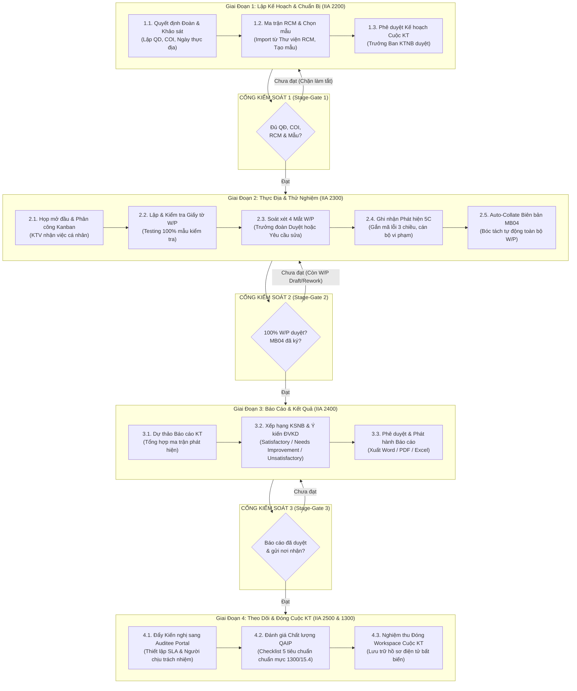
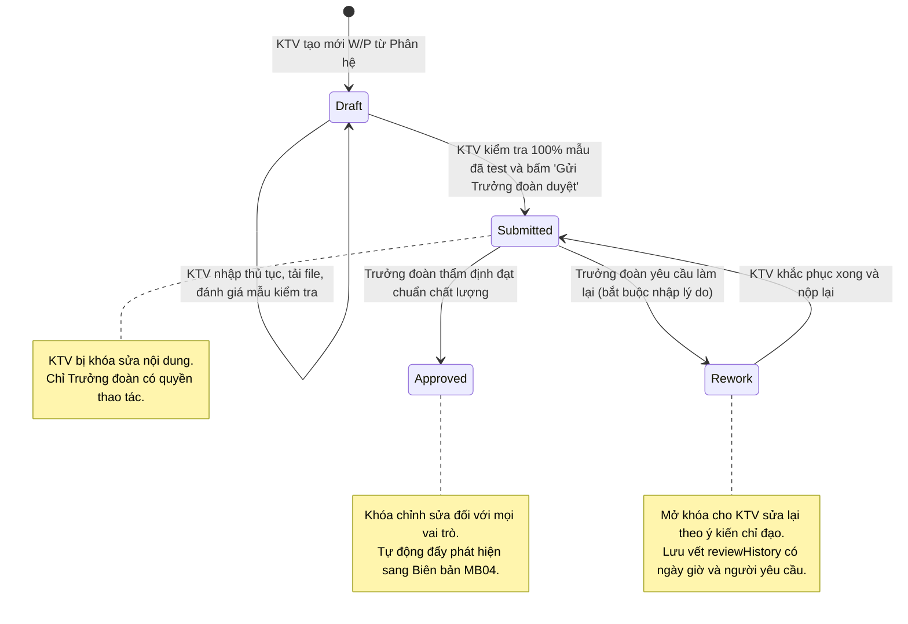

# CẨM NANG NGHIỆP VỤ & HƯỚNG DẪN SỬ DỤNG HỆ THỐNG SMART AUDIT V4.0
### Hệ Thống Quản Lý Kiểm Toán Nội Bộ Chuẩn Hóa Theo IIA GIAS 2024 & Ngân Hàng Nhà Nước

---

## MỤC LỤC
1. [Bảng Thuyết Minh Thuật Ngữ Kiểm Toán & Viết Tắt (Glossary)](#1-bảng-thuyết-minh-thuật-ngữ-kiểm-toán--viết-tắt-glossary)
2. [Kiến Thức Cốt Lõi Về Kiểm Toán Nội Bộ Ngân Hàng](#2-kiến-thức-cốt-lõi-về-kiểm-toán-nội-bộ-ngân-hàng)
3. [Các Nhận Định Sai Lầm Thường Gặp (Misconceptions & Pitfalls)](#3-các-nhận-định-sai-lầm-thường-gặp-misconceptions--pitfalls)
4. [Bảng Workflow & Ma Trận Nhập - Duyệt - Rework (RACI Matrix)](#4-bảng-workflow--ma-trận-nhập---duyệt---rework-raci-matrix)
5. [Hướng Dẫn Sử Dụng Phần Mềm Theo Từng Bước (Step-by-Step Manual)](#5-hướng-dẫn-sử-dụng-phần-mềm-theo-từng-bước-step-by-step-manual)
   - [Giai Đoạn 1: Lập Kế Hoạch & Chuẩn Bị (IIA Standard 2200)](#51-giai-đoạn-1-lập-kế-hoạch--chuẩn-bị-iia-standard-2200)
   - [Giai Đoạn 2: Thực Địa & Thử Nghiệm (IIA Standard 2300)](#52-giai-đoạn-2-thực-địa--thử-nghiệm-iia-standard-2300)
   - [Giai Đoạn 3: Báo Cáo & Kết Quả (IIA Standard 2400)](#53-giai-đoạn-3-báo-cáo--kết-quả-iia-standard-2400)
   - [Giai Đoạn 4: Theo Dõi & Đóng Cuộc KT (IIA Standard 2500 & 1300)](#54-giai-đoạn-4-theo-dõi--đóng-cuộc-kt-iia-standard-2500--1300)
   - [Các Phân Hệ Bổ Trợ Quản Trị](#55-các-phân-hệ-bổ-trợ-quản-trị)

---

## 1. BẢNG THUYẾT MINH THUẬT NGỮ KIỂM TOÁN & VIẾT TẮT (GLOSSARY)

Bảng dưới đây chuẩn hóa toàn bộ các thuật ngữ quốc tế và thuật ngữ nghiệp vụ ngân hàng được cài đặt trong mã nguồn phần mềm:

| Thuật ngữ / Viết tắt | Tên tiếng Anh | Định nghĩa & Ý nghĩa nghiệp vụ trong phần mềm |
|---|---|---|
| **IIA** | The Institute of Internal Auditors | Hiệp hội Kiểm toán Nội bộ Quốc tế - cơ quan ban hành Chuẩn mực Thực hành Kiểm toán Quốc tế. |
| **GIAS 2024 / IPPF** | Global Internal Audit Standards / International Professional Practices Framework | Chuẩn mực Kiểm toán Nội bộ Toàn cầu mới nhất (ban hành 2024, có hiệu lực từ 01/2025), quy định toàn diện 5 miền nghiệp vụ và các nguyên tắc đạo đức. |
| **CAE** | Chief Audit Executive | Trưởng Ban Kiểm toán Nội bộ (hoặc Giám đốc KTNB). Người chịu trách nhiệm cao nhất về hoạt động KTNB trước Ban Kiểm soát (BKS) và Hội đồng Quản trị (HĐQT). |
| **Lead Auditor** | Audit Team Leader | Trưởng đoàn kiểm toán. Phụ trách quản lý điều hành cuộc kiểm toán, phân công nhiệm vụ, soát xét (review) Giấy tờ làm việc và chốt biên bản MB04. |
| **Auditee** | Audited Entity / Audited Department | Đơn vị được kiểm toán (Chi nhánh, Phòng Giao dịch, Khối nghiệp vụ Hội sở, Công ty con). |
| **Audit Universe** | Audit Universe (Vũ trụ Kiểm toán) | Toàn bộ danh mục các thực thể kiểm toán (đơn vị, chi nhánh, phòng ban, sản phẩm, quy trình, hệ thống CNTT) có thể đưa vào diện đánh giá rủi ro và lập kế hoạch kiểm toán. |
| **Audit Plan** | Annual Audit Plan | Kế hoạch kiểm toán năm được BKS/HĐQT phê duyệt dựa trên đánh giá rủi ro định lượng, bao gồm danh mục các cuộc kiểm toán trong năm. |
| **Audit Engagement** | Audit Engagement | Một cuộc kiểm toán cụ thể (ví dụ: *Kiểm toán Quy trình Tín dụng Chi nhánh Hà Nội 2026*). |
| **Workstream** | Audit Workstream (Phân hệ kiểm toán) | Một phân hệ / mảng nghiệp vụ chuyên biệt trong cuộc kiểm toán (ví dụ: *Phân hệ Tín dụng KHCN*, *Phân hệ Kho quỹ & Phi tín dụng*). |
| **Working Paper (W/P)** | Audit Working Paper | Giấy tờ làm việc kiểm toán. Hồ sơ lưu trữ tài liệu, bằng chứng, phương pháp chọn mẫu, thủ tục kiểm tra chi tiết của KTV để chứng minh cho kết luận kiểm toán. |
| **RCM** | Risk and Control Matrix | Ma trận Rủi ro và Kiểm soát. Bảng đối chiếu giữa: Mục tiêu nghiệp vụ $\rightarrow$ Rủi ro tiềm ẩn $\rightarrow$ Chốt kiểm soát $\rightarrow$ Thủ tục kiểm tra của KTV. |
| **Inherent Risk** | Inherent Risk (Rủi ro tiềm tàng) | Rủi ro tự nhiên vốn có của quy trình/sản phẩm khi **chưa** tính đến bất kỳ hành động hoặc chốt kiểm soát nào của ban điều hành. |
| **Control Risk** | Control Risk (Rủi ro kiểm soát) | Rủi ro mà hệ thống KSNB của ngân hàng không thể ngăn chặn, phát hiện hoặc xử lý kịp thời các sai sót/vi phạm trọng yếu. |
| **Residual Risk** | Residual Risk (Rủi ro còn lại) | Rủi ro còn tồn đọng sau khi đã thiết lập và vận hành các chốt kiểm soát nội bộ ($Residual = Inherent - Control$). |
| **Mô hình 5C** | 5C Finding Structure | Chuẩn mực kết cấu một Phát hiện kiểm toán gồm: **C**ondition (Thực trạng) - **C**riteria (Tiêu chí quy định) - **C**ause (Nguyên nhân gốc) - **C**onsequence (Hậu quả/Tác động) - **C**orrective Action (Kiến nghị khắc phục). |
| **MB04** | Fieldwork Audit Minutes | Biên bản kiểm toán thực địa lập tại đơn vị, tổng hợp toàn bộ các phát hiện đã trao đổi thống nhất trước khi rời cơ sở. |
| **QAIP** | Quality Assurance and Improvement Program | Chương trình Đảm bảo và Nâng cao Chất lượng KTNB (Chuẩn mực IIA 1300 & Global Standard 15.4), đánh giá tính tuân thủ quy trình của từng cuộc kiểm toán. |
| **Four-Eyes Principle** | Four-Eyes Principle (Nguyên tắc 4 mắt) | Nguyên tắc kiểm soát kép: Bất kỳ dữ liệu, W/P hay đề xuất nào của KTV đều phải được ít nhất một cấp độc lập (Trưởng đoàn/Người soát xét) phê duyệt trước khi có hiệu lực. |
| **Stage-Gate** | Stage-Gate Control (Cổng kiểm soát giai đoạn) | Cơ chế kỹ thuật chặn làm tắt giai đoạn: Không thể chuyển từ Giai đoạn 1 sang 2 nếu chưa hoàn tất Quyết định & RCM; không thể sang Giai đoạn 3 nếu chưa đóng 100% W/P. |
| **Defect Taxonomy** | Defect Taxonomy (Danh mục Lỗi 3 chiều) | Hệ thống mã hóa sai phạm chuẩn hóa gồm 3 hệ quy chiếu: `INTERNAL` (Lỗi nội bộ LPBank), `ND340` (Xử phạt NHNN theo Nghị định 340), `NHANSU` (Khung xử lý kỷ luật lao động). |
| **KRI** | Key Risk Indicator | Chỉ số Rủi ro Trọng yếu - các chỉ số định lượng giúp cảnh báo sớm nguy cơ suy giảm chất lượng kiểm soát (ví dụ: tỷ lệ nợ xấu, số lượng giao dịch ngoại bảng). |
| **COSO** | Committee of Sponsoring Organizations | Khung kiểm soát nội bộ tích hợp (COSO 2013) gồm 5 cấu phần: Môi trường kiểm soát, Đánh giá rủi ro, Hoạt động kiểm soát, Thông tin & Truyền thông, Giám sát. |
| **Thông tư 13/TT-NHNN** | Circular 13/2018/TT-NHNN | Thông tư của Ngân hàng Nhà nước quy định về hệ thống KSNB của NHTM (trong đó có quy định bắt buộc về 3 tuyến phòng thủ và KTNB). |

---

## 2. KIẾN THỨC CỐT LÕI VỀ KIỂM TOÁN NỘI BỘ NGÂN HÀNG

### 2.1. Mô Hình 3 Tuyến Phòng Thủ (Three Lines Model - IIA 2020 & Thông Tư 13)
KTNB không thay thế quản lý rủi ro của vận hành, mà đóng vai trò là tuyến phòng thủ độc lập cao nhất:
1. **Tuyến 1 (Tuyến Khởi tạo & Quản lý Rủi ro Trực tiếp)**: Chi nhánh, Phòng giao dịch, Khối kinh doanh, Vận hành, Công nghệ thông tin. Trách nhiệm: Thiết lập chốt kiểm soát tác nghiệp, tự kiểm tra rủi ro (RCSA - Risk & Control Self-Assessment).
2. **Tuyến 2 (Tuyến Giám sát & Quản trị Rủi ro Độc lập)**: Khối Quản lý Rủi ro, Khối Tuân thủ & Pháp chế. Trách nhiệm: Thiết lập chính sách rủi ro, đo lường hạn mức, theo dõi chỉ số rủi ro KRI, giám sát tuân thủ luật định.
3. **Tuyến 3 (Tuyến Đảm bảo Độc lập & Khách quan - KTNB)**: Ban Kiểm toán Nội bộ (trực thuộc Ban Kiểm soát). Trách nhiệm: Đánh giá độc lập về tính đầy đủ, hiệu lực và hiệu quả của cả Tuyến 1 và Tuyến 2; báo cáo trực tiếp cho Ban Kiểm soát và Hội đồng Quản trị.

```
┌─────────────────────────────────────────────────────────────┐
│             HỘI ĐỒNG QUẢN TRỊ & BAN KIỂM SOÁT               │
└──────────────┬───────────────────────────────▲──────────────┘
               │ Trách nhiệm quản trị          │ Báo cáo độc lập
               ▼                               │
┌──────────────────────────────┐ ┌─────────────┴──────────────┐
│       TỔNG GIÁM ĐỐC          │ │   TUYẾN 3: BAN KIỂM TOÁN   │
│       & BAN ĐIỀU HÀNH        │ │         NỘI BỘ (KTNB)      │
└───────┬──────────────┬───────┘ └────────────────────────────┘
        │              │
        ▼              ▼
┌──────────────┐ ┌──────────────┐
│   TUYẾN 1    │ │   TUYẾN 2    │
│ Vận hành, KD │ │ QLRR, Pháp chế│
│ Chốt KSNB    │ │ Giám sát KRI │
└──────────────┘ └──────────────┘
```

### 2.2. Tính Độc Lập và Khách Quan (Independence & Objectivity)
- **Độc lập về cơ cấu (Organizational Independence)**: KTNB trực thuộc Ban Kiểm soát, không chịu sự điều hành của Tổng Giám đốc; không tham gia vận hành, không phê duyệt tín dụng, không trực tiếp viết quy chế vận hành cho Tuyến 1.
- **Khách quan cá nhân (Individual Objectivity)**: KTV không được kiểm toán các hoạt động mà mình đã từng phụ trách trong vòng tối thiểu **12 tháng** gần nhất (quy tắc quay vòng và phòng ngừa xung đột lợi ích COI - *Conflict of Interest*).
- **Hệ thống hóa trên phần mềm**: Phân hệ `IndependenceTracker` tự động quét lịch sử làm việc của nhân sự, đối chiếu đơn vị dự kiến kiểm toán và tự động chặn (Warning/Block) nếu phát hiện xung đột lợi ích.

### 2.3. Phương Pháp Kiểm Toán Định Hướng Rủi Ro (Risk-Based Internal Audit - RBIA)
- Thay vì kiểm toán dàn trải ngẫu nhiên, RBIA tập trung nguồn lực kiểm toán vào các khu vực có **Rủi ro còn lại (Residual Risk)** vượt quá khẩu vị rủi ro (*Risk Appetite*) của Ngân hàng.
- Quy trình đánh giá rủi ro tích hợp 3 luồng dữ liệu (Data Triangulation):
  - *Dữ liệu định tính*: Kết quả phỏng vấn, khảo sát, quy mô tổ chức.
  - *Dữ liệu định lượng (Continuous Monitoring)*: Chỉ số vi phạm, biến động nợ xấu, tỷ lệ hoàn chứng từ, số lần cảnh báo gian lận.
  - *Dữ liệu lịch sử*: Số phát hiện quá hạn chưa khắc phục từ các cuộc kiểm toán trước.

---

## 3. CÁC NHẬN ĐỊNH SAI LẦM THƯỜNG GẶP (MISCONCEPTIONS & PITFALLS)

### ❌ Sai Lầm 1: Đồng Nhất "Rủi Ro" (Risk) Với "Sai Sót / Phát Hiện" (Defect / Finding)
- **Nhận định sai**: *"Chi nhánh này có 10 lỗi vi phạm tín dụng, vậy rủi ro ở đây là 10 lỗi đó"*.
- **Bản chất chuẩn mực**:
  - **Rủi ro (Risk)** là một **khả năng trong tương lai** (*Uncertain future event*) có thể gây thiệt hại tài chính, pháp lý hoặc uy tín khiến ngân hàng không đạt được mục tiêu (ví dụ: *Rủi ro thất thoát vốn do tài sản bảo đảm bị định giá cao hơn giá trị thị trường*).
  - **Sai sót / Vi phạm (Finding/Defect)** là một **sự kiện đã xảy ra trong quá khứ/hiện tại** vi phạm một quy định cụ thể (ví dụ: *Hồ sơ số 123 thiếu biên bản kiểm tra thực địa TSBĐ theo Khoản 2 Điều 15 Quyết định 456*).
  - **Mối quan hệ**: Sai sót là **bằng chứng thực tế** chứng minh rằng chốt kiểm soát đang bị tê liệt, làm tăng xác suất xảy ra rủi ro.

---

### ❌ Sai Lầm 2: Nghĩ Rằng "Rủi Ro Tiềm Tàng" (Inherent Risk) Sẽ Giảm Đi Khi Có Kiểm Soát Tốt
- **Nhận định sai**: *"Hệ thống phê duyệt tự động của chúng tôi rất chặt chẽ, nên rủi ro tiềm tàng của mảng Cho vay tín chấp tiêu dùng chỉ ở mức Thấp"*.
- **Bản chất chuẩn mực**:
  - **Rủi ro tiềm tàng (Inherent Risk)** phản ánh **bản chất khách quan** của nghiệp vụ khi hoàn toàn không có kiểm soát. Nghiệp vụ cho vay tín chấp tiêu dùng hoặc chuyển tiền quốc tế luôn có rủi ro tiềm tàng ở mức **RẤT CAO**, bất kể ngân hàng nào thực hiện.
  - Kiểm soát tốt chỉ làm giảm **Rủi ro còn lại (Residual Risk)**, chứ không bao giờ làm giảm rủi ro tiềm tàng:
  $$\text{Rủi ro còn lại (Residual)} = \text{Rủi ro tiềm tàng (Inherent)} \times (1 - \text{Hiệu lực kiểm soát (Control Effectiveness)})$$
  - Nếu chốt kiểm soát tự động gặp trục trặc kỹ thuật, rủi ro lập tức bật ngược trở lại mức Rủi ro tiềm tàng cao nhất!

---

### ❌ Sai Lầm 3: Coi "Hồ Sơ Rủi Ro" (Risk Profile) Là Bảng Thống Kê Vi Phạm Cũ
- **Nhận định sai**: *"Hồ sơ rủi ro của Chi nhánh X là danh sách các lỗi biên bản kiểm toán năm ngoái chưa sửa"*.
- **Bản chất chuẩn mực**:
  - **Hồ sơ rủi ro (Risk Profile)** là một **bản đồ cấu trúc động** phản ánh bức tranh phơi nhiễm rủi ro toàn diện của một thực thể kiểm toán theo toàn bộ các chiều: Rủi ro Tín dụng, Vận hành, Thị trường, Thanh khoản, Gian lận, CNTT & An ninh mạng, Pháp chế & Tuân thủ.
  - Hồ sơ rủi ro bao gồm: Ma trận các sự kiện rủi ro L1/L2, các biện pháp kiểm soát chủ chốt tương ứng, mức độ rủi ro tiềm tàng, hiệu lực vận hành của chốt kiểm soát, và mã lỗi thực tế liên kết.
  - Trên phần mềm Smart Audit, Hồ sơ rủi ro được chia thành 12 domain nghiệp vụ chuẩn hóa (`HS01_HSRR_CNTT` đến `HS12_HSRR_NHBL`), hỗ trợ điều chỉnh qua cơ chế phê duyệt 2 cấp.

---

### ❌ Sai Lầm 4: Phân Loại Mức Độ Rủi Ro (Risk Level) Chỉ Dựa Vào "Số Tiền Tổn Thất"
- **Nhận định sai**: *"Sai phạm này không làm mất tiền của ngân hàng (tổn thất = 0 VNĐ), nên chỉ xếp rủi ro Thấp (Low)"*.
- **Bản chất chuẩn mực**:
  - Mức độ nghiêm trọng của rủi ro/phát hiện trong Ngân hàng thương mại được xác định bởi **Ma trận 3 Chiều**:
    1. **Tổn thất tài chính trực tiếp**: Số tiền có nguy cơ mất mát.
    2. **Chế tài xử phạt của Ngân hàng Nhà nước**: Căn cứ theo **Nghị định 340/NĐ-CP**. Một vi phạm không làm mất tiền nhưng vi phạm giới hạn cấp tín dụng hoặc phân loại nợ sai có thể bị NHNN phạt tiền hàng trăm triệu đồng, đình chỉ hoạt động nghiệp vụ, hoặc hạ xếp hạng tín nhiệm CAMELS của ngân hàng.
    3. **Rủi ro danh tiếng & An toàn hệ thống**: Vi phạm liên quan đến bảo vệ dữ liệu khách hàng, an ninh mạng, phòng chống rửa tiền (AML) có thể gây khủng hoảng niềm tin toàn hệ thống.
  - Do đó, phát hiện dù tổn thất 0 VNĐ nhưng vi phạm quy định cấm của NHNN bắt buộc phải phân loại là **Cao (High)** hoặc **Nghiêm trọng (Critical)**.

---

### ❌ Sai Lầm 5: Đánh Giá Rủi Ro Một Lần Vào Đầu Năm Là Đủ (Static vs. Dynamic Risk Assessment)
- **Nhận định sai**: *"Tháng 12 đã duyệt Kế hoạch kiểm toán năm rồi, cứ thế mà đi làm theo đúng lịch cho đến hết năm"*.
- **Bản chất chuẩn mực**:
  - Môi trường ngân hàng biến động liên tục (lãi suất biến động, nhân sự lãnh đạo chi nhánh thay đổi, ra mắt sản phẩm số mới).
  - Phần mềm cài đặt cơ chế **Đánh giá rủi ro động liên tục (Continuous Monitoring & Dynamic Rerating)**: Nếu một chi nhánh đột ngột có tỷ lệ nợ quá hạn tăng vọt, hoặc KRI cảnh báo giao dịch ngoài giờ bất thường, hệ thống sẽ tự động tính lại điểm rủi ro, kích hoạt cảnh báo đổi màu và đề xuất đưa vào cuộc kiểm toán đột xuất (*Unplanned Engagement*).

---

### ❌ Sai Lầm 6: Nhầm Lẫn Giữa "Thực Trạng" (Condition) Và "Nguyên Nhân Gốc Rễ" (Root Cause) Trong Mô Hình 5C
- **Nhận định sai**: Ghi trong phát hiện: *"Thực trạng: Hồ sơ thiếu xác minh nguồn thu. Nguyên nhân: Do KTV tín dụng không thu thập xác minh nguồn thu"*.
- **Bản chất chuẩn mực**:
  - Cách ghi trên là **lặp lại thực trạng (Tautology)**, không phải là nguyên nhân!
  - **Nguyên nhân gốc rễ (Root Cause)** phải trả lời câu hỏi *Tại sao lại có kẽ hở đó?*:
    - Do Quy định của ngân hàng chưa quy định rõ mẫu xác minh? (Thiếu sót chính sách)
    - Do chỉ tiêu KPI thúc ép giải ngân quá gấp, áp lực doanh số? (Văn hóa rủi ro)
    - Do hệ thống phần mềm Core Banking không chặn nút giải ngân khi chưa upload chứng từ? (Lỗ hổng kiểm soát tự động)
  - Nếu không tìm ra nguyên nhân gốc rễ, **Kiến nghị khắc phục (Recommendation)** sẽ chỉ là: *"Yêu cầu KTV tín dụng lần sau thu thập đủ"* $\rightarrow$ Chắc chắn sai phạm sẽ tái diễn ở đợt kiểm toán sau!

---

## 4. BẢNG WORKFLOW & MA TRẬN NHẬP - DUYỆT - REWORK (RACI MATRIX)

### 4.1. Sơ Đồ Toàn Bộ Vòng Đời Cuộc Kiểm Toán Chuẩn IIA



---

### 4.2. Ma Trận Phân Quyền Trách Nhiệm RACI (Nhập, Soát Xét, Phê Duyệt, Làm Lại)

*Ký hiệu RACI:*
- **R (Responsible)**: Người trực tiếp thực hiện / nhập liệu.
- **A (Accountable)**: Người chịu trách nhiệm phê duyệt cuối cùng (duy nhất 1 người).
- **C (Consulted)**: Người được tham vấn / trao đổi ý kiến.
- **I (Informed)**: Người được thông báo kết quả.

| Phân hệ / Nghiệp vụ | Kiểm toán viên (KTV) | Trưởng đoàn (Lead Auditor) | Trưởng Ban KTNB (CAE) | Ban Kiểm soát (BKS) / HĐQT | Đơn vị được kiểm toán (Auditee) |
|---|:---:|:---:|:---:|:---:|:---:|
| **1. Lập Kế hoạch năm (Audit Plan)** | C | C | **R** | **A** | I |
| **2. Điều chỉnh Hồ sơ rủi ro (Risk Profile)** | R | C | **A** | I | C |
| **3. Lập Quyết định & Đội ngũ Cuộc KT** | I | R | **A** | I | I |
| **4. Lập Ma trận RCM & Chọn mẫu** | **R** | **A** | I | I | I |
| **5. Thực hiện W/P & Đánh giá mẫu** | **R** | C | I | I | C |
| **6. Soát xét W/P (Review / Rework)** | C (sửa khi rework) | **R / A** | I | I | I |
| **7. Ghi nhận Phát hiện 5C & Mã lỗi** | **R** | **A** | I | I | C |
| **8. Tổng hợp & Ký Biên bản MB04** | C | **R** | I | I | **A (Ký xác nhận)** |
| **9. Phát hành Báo cáo Kiểm toán** | C | R | **A** | **I (Báo cáo)** | **A (Tiếp nhận)** |
| **10. Cập nhật khắc phục Kiến nghị** | I | C | I | I | **R** |
| **11. Đánh giá QAIP & Đóng Workspace** | I | R | **A** | I | I |

---

### 4.3. Máy Trạng Thái Của Giấy Tờ Làm Việc W/P (Review & Rework State Machine)



---

## 5. HƯỚNG DẪN SỬ DỤNG PHẦN MỀM THEO TỪNG BƯỚC (STEP-BY-STEP MANUAL)

### 5.1. Giai Đoạn 1: Lập Kế Hoạch & Chuẩn Bị (IIA Standard 2200)

#### Bước 1.1: Quản Lý Quyết Định Thành Lập Đoàn & Phân Bổ Nhân Sự
1. **Truy cập**: Vào menu **Cuộc kiểm toán** (`/audit-engagements`) $\rightarrow$ Chọn cuộc kiểm toán cần thao tác $\rightarrow$ Mở **GIAI ĐOẠN 1** $\rightarrow$ Sub-tab **1.1. Quyết định & Khảo sát**.
2. **Kế thừa thông tin**:
   - Trường *Thuộc kế hoạch* hiển thị Select chọn Kế hoạch năm đã phê duyệt.
   - Chọn *Trưởng đoàn kiểm toán* và *Đơn vị được kiểm toán*. Hệ thống sẽ kích hoạt tính năng quét an toàn độc lập (COI check). Nếu KTV từng làm việc tại đơn vị trong 12 tháng, hệ thống cảnh báo vi phạm màu vàng ⚠️.
   - Nhập *Số quyết định thành lập đoàn* (ví dụ: `123/2026/QĐ-KTNB`) và *Ngày quyết định*.
3. **Thêm thành viên đoàn**:
   - Bấm **Thêm thành viên** $\rightarrow$ Chọn KTV trong danh sách và phân bổ vai trò (*KTV Tín dụng, KTV Vận hành, KTV CNTT*).
   - Bấm **Lưu thông tin**.

#### Bước 1.2: Thiết Lập Ma Trận Rủi Ro (RCM) & Chương Trình Kiểm Toán
1. **Mở Sub-tab 1.3. Đánh giá Rủi ro & RCM**:
   - Bấm nút `📥 Nhập từ Thư viện RCM`.
   - Cửa sổ thư viện mở ra $\rightarrow$ Chọn các rủi ro tương ứng với mảng nghiệp vụ của cuộc kiểm toán $\rightarrow$ Bấm **Đồng bộ vào Cuộc kiểm toán**.
   - Hệ thống tự động tạo các **Phân hệ kiểm toán (Workstream)** tương ứng.
2. **Tạo Phân hệ kiểm toán bổ sung (nếu cần)**:
   - Bấm `+ Tạo phân hệ` $\rightarrow$ Nhập Tên phân hệ $\rightarrow$ Chọn **Vùng rủi ro** từ dropdown chuẩn hóa 8 nhóm (*Tín dụng, Vận hành, CNTT, Kho quỹ, PGDBĐ, Tuân thủ, Thị trường, Tổng hợp*) $\rightarrow$ Phân công KTV phụ trách $\rightarrow$ Bấm **Lưu**.

#### Bước 1.3: Khởi Tạo Mẫu Thử Nghiệm Kiểm Toán
1. **Mở Sub-tab 1.4. Chọn mẫu kiểm toán**:
   - Xem danh sách các mẫu dữ liệu từ Core Banking hoặc tải file Excel danh sách giao dịch.
   - Thiết lập tiêu chí chọn mẫu: Chọn mẫu theo giá trị lớn (*MUS - Monetary Unit Sampling*), mẫu rủi ro cao (*Risk-based Sampling*) hoặc mẫu ngẫu nhiên (*Random Sampling*).

#### Bước 1.4: Nghiệm Thu Chuyển Giai Đoạn (Stage-Gate 1)
- Ở thanh chân trang, bấm nút **Hoàn thành Giai đoạn 1 & Chuyển sang Thực địa**.
- Nếu thiếu Quyết định, ngày thực địa hoặc chưa phân công KTV, hệ thống sẽ chặn lại và thông báo chi tiết mục còn thiếu.

---

### 5.2. Giai Đoạn 2: Thực Địa & Thử Nghiệm (IIA Standard 2300)

#### Bước 2.1: Phân Phối Công Việc Trên Bảng Kanban Nhiệm Vụ
1. **Mở Sub-tab 2.2. Nhiệm vụ thực địa (Kanban)**:
   - Xem toàn bộ các đầu việc được chia theo 4 cột: *Cần làm (Todo)*, *Đang thực hiện (InProgress)*, *Chờ duyệt (Review)*, *Hoàn thành (Done)*.
   - Kéo thả các thẻ nhiệm vụ để cập nhật trạng thái thực tế.
   - Bấm vào một thẻ để chỉ định người phụ trách và đặt ngày hạn chót (Deadline).

#### Bước 2.2: Lập Giấy Tờ Làm Việc (W/P) Cho Kiểm Toán Viên
1. **Mở Sub-tab 2.3. Giấy tờ làm việc (W/P)**:
   - Bấm bộ lọc `👤 Việc của tôi` để lọc riêng các W/P mà cá nhân KTV được phân công.
   - Bấm **Xem chi tiết / Đánh giá** để mở **WorkingPaperDetailDrawer**.
2. **Kế thừa & Thực hiện thử nghiệm mẫu**:
   - Tên đơn vị, đợt kiểm toán và phân hệ được hiển thị cố định có huy hiệu bảo đảm tính nhất quán.
   - Trong bảng **Ma trận Mẫu kiểm tra (Sampling Grid)**: Duyệt từng dòng mẫu, đánh giá kết quả:
     - `Pass` (🟢 Đạt chuẩn quy định).
     - `Fail` (🔴 Sai phạm / Lỗi vi phạm).
     - `Pending` (🟡 Đang thu thập thêm chứng từ).
   - Đính kèm file chứng từ bằng chứng kiểm toán (*File PDF hợp đồng, ảnh chụp màn hình CoreBanking*).
3. **Nộp duyệt 4 mắt**:
   - Chỉ khi tỷ lệ đánh giá mẫu đạt 100%, nút **Gửi Trưởng đoàn duyệt (Submit)** mới mở.
   - Bấm **Gửi Trưởng đoàn duyệt**. W/P chuyển sang trạng thái `Submitted`, KTV bị khóa sửa.

#### Bước 2.3: Trưởng Đoàn Soát Xét & Yêu Cầu Chỉnh Sửa (Review & Rework)
1. **Trưởng đoàn mở W/P**: Xem bằng chứng và kết quả thử nghiệm của KTV.
2. **Quyết định soát xét**:
   - **Nếu đạt**: Bấm `Phê duyệt (Approve)` $\rightarrow$ W/P chuyển sang trạng thái `Approved` (Khóa vĩnh viễn).
   - **Nếu chưa đạt / bằng chứng chưa tin cậy**: Bấm `Yêu cầu làm lại (Rework)` $\rightarrow$ Cửa sổ bắt buộc nhập *Ghi chú yêu cầu chỉnh sửa* $\rightarrow$ KTV nhận thông báo, W/P mở khóa chuyển về trạng thái `Rework`.

#### Bước 2.4: Ghi Nhận Phát Hiện Kiểm Toán Chuẩn 5C
1. **Tạo trực tiếp từ W/P**: Trong W/P có dòng mẫu bị `Fail`, bấm nút `+ Tạo Phát hiện từ dòng này`.
2. **Nhập liệu theo chuẩn 5C trên [`AuditFindings.tsx`](file:///c:/Users/ducth/phan%20mem/frontend/src/pages/AuditFindings.tsx)**:
   - **Đơn vị vi phạm**: Trường `branchCode` và `managingBranchName` được **tự động khóa và kế thừa**, chống gõ sai.
   - **Mã lỗi nội bộ LPBank (`internalDefectCode`)**: Chọn từ dropdown nạp động từ API (ví dụ: `TD_01: Thiếu hồ sơ pháp lý KH vay`).
   - **Mã lỗi xử phạt NHNN NĐ 340 (`nd340DefectCode`)**: Chọn điều khoản vi phạm và mức phạt tiền tối đa (ví dụ: `Đ14.K3.b: Vi phạm quy định thẩm định cấp tín dụng - Phạt tối đa 100 triệu`).
   - **Chế tài nhân sự (`nhanSuDefectCode`)**: Chọn mức đề xuất kỷ luật (*Khiển trách, Cảnh cáo, Cách chức*).
   - **Cán bộ vi phạm**: Chọn trực tiếp từ Select danh sách nhân sự cho các vai trò: Cán bộ đề xuất, Cán bộ thẩm định, Lãnh đạo phê duyệt.
   - **Nội dung 5C**: Nhập đủ Thực trạng, Tiêu chí quy định bị vi phạm, Phân tích nguyên nhân gốc rễ, Hậu quả tác động, và Kiến nghị khắc phục.

#### Bước 2.5: Tự Động Tổng Hợp Biên Bản Thực Địa MB04 (Auto-Collate)
1. **Mở Sub-tab 2.5. Biên bản kiểm toán (MB04)**:
   - Bấm nút `⚡ Tổng hợp tự động từ WP (Auto-Collate)`.
   - Hệ thống tự động quét toàn bộ các W/P đã được Trưởng đoàn duyệt (`Approved`), trích xuất số lượng mẫu kiểm tra, số mẫu sai sót và toàn bộ danh mục phát hiện 5C vào biên bản.
   - Trường Số quyết định, Tên đơn vị, Trưởng đoàn được điền sẵn chính xác 100%.
2. **Ký xác nhận**:
   - Xuất file Word/PDF biên bản MB04 $\rightarrow$ Tổ chức họp kết thúc kiểm toán thực địa $\rightarrow$ Cập nhật trạng thái `Confirmed` (Đã chốt & Ký xác nhận).

---

### 5.3. Giai Đoạn 3: Báo Cáo & Kết Quả (IIA Standard 2400)

#### Bước 3.1: Dự Thảo Báo Cáo & Xếp Hạng KSNB
1. **Mở GIAI ĐOẠN 3** $\rightarrow$ Sub-tab **3.1. Dự thảo Báo cáo KT**:
   - Hệ thống hiển thị tổng quan xếp hạng rủi ro của cuộc kiểm toán.
   - Trong phần **Xếp hạng nghiệp vụ & Ma trận ĐVKD**: Chọn xếp hạng chuẩn hóa từ Select:
     - Xếp hạng Tín dụng KHCN: 🟢 *Đạt yêu cầu* / 🟡 *Cần cải thiện* / 🔴 *Không đạt*.
     - Xếp hạng Tín dụng KHDN: 🟢 *Đạt yêu cầu* / 🟡 *Cần cải thiện* / 🔴 *Không đạt*.
     - Xếp hạng Phi tín dụng & Kho quỹ: 🟢 *Đạt yêu cầu* / 🟡 *Cần cải thiện* / 🔴 *Không đạt*.
     - **Xếp hạng Tổng thể Chi nhánh**: Chọn mức tương ứng dựa trên ma trận tính điểm rủi ro.

#### Bước 3.2: Xuất Báo Cáo Chính Thức
- Bấm các nút xuất đa định dạng:
  - `📄 Xuất Báo cáo Word (.docx)`: Tự động điền theo biểu mẫu báo cáo chuẩn của Ngân hàng kèm đầy đủ phụ lục.
  - `📑 Xuất PDF`: Phục vụ trình ký số Ban Kiểm soát và Hội đồng Quản trị.
  - `📊 Xuất Ma trận Excel`: Phục vụ phân tích số liệu và hậu kiểm.

---

### 5.4. Giai Đoạn 4: Theo Dõi & Đóng Cuộc KT (IIA Standard 2500 & 1300)

#### Bước 4.1: Giám Sát Khắc Phục Kiến Nghị & SLA
1. **Mở Sub-tab 4.1. Giám sát kiến nghị**:
   - Toàn bộ các kiến nghị từ Báo cáo chính thức tự động đồng bộ sang cổng thông tin của Đơn vị được kiểm toán (**Auditee Portal**).
   - Đơn vị được kiểm toán truy cập, đính kèm bằng chứng khắc phục (chứng từ chỉnh sửa, biên bản thu hồi nợ).
   - Hệ thống theo dõi SLA (Số ngày còn lại / Quá hạn) và đổi màu cảnh báo tự động:
     - 🟢 *Còn hạn (> 15 ngày)*.
     - 🟡 *Sắp đến hạn (< 5 ngày)*.
     - 🔴 *Quá hạn (Overdue) - Tự động kích hoạt leo thang báo cáo cấp lãnh đạo*.

#### Bước 4.2: Đánh Giá Đảm Bảo Chất Lượng QAIP (Chuẩn Mực IIA 1300 & 15.4)
1. **Mở Sub-tab 4.2. Checklist QAIP**:
   - Trưởng đoàn và Cán bộ QAIP tích chọn xác nhận 5 tiêu chí bắt buộc:
     - [x] Mục tiêu và phạm vi kiểm toán được xác định rõ ràng, có căn cứ rủi ro.
     - [x] KTV cam kết tính độc lập khách quan và không có xung đột lợi ích.
     - [x] 100% Giấy tờ làm việc có bằng chứng đầy đủ, tin cậy và được Trưởng đoàn soát xét.
     - [x] Phát hiện kiểm toán chuẩn mực theo cấu trúc 5C.
     - [x] Các phát hiện và khuyến nghị đã được thống nhất với đơn vị và có cam kết thời hạn.

#### Bước 4.3: Nghiệm Thu Đóng Workspace Cuộc Kiểm Toán
- Khi thanh tiến độ đạt 100%, bấm nút **Đóng Cuộc kiểm toán**.
- Toàn bộ workspace cuộc kiểm toán chuyển sang trạng thái `Closed / Archived` (Chỉ đọc). Mọi can thiệp sửa chữa sau ngày đóng đều được lưu vết vào `AuditTrail` bất biến.

---

### 5.5. Các Phân Hệ Bổ Trợ Quản Trị

1. **Hồ Sơ Rủi Ro ([`RiskProfilesTab.tsx`](file:///c:/Users/ducth/phan%20mem/frontend/src/components/RiskProfilesTab.tsx))**:
   - Quản lý danh mục rủi ro của 12 domain nghiệp vụ.
   - Khi cần cập nhật tiêu chí hoặc thêm mã lỗi: Bấm **Sửa** $\rightarrow$ Chọn danh mục lỗi liên kết từ Multi-select $\rightarrow$ Nhập lý do $\rightarrow$ Bấm **Gửi Trình Phê Duyệt**.
   - Đề xuất được chuyển sang luồng phê duyệt 2 cấp: Cấp 1 (Lãnh đạo Phòng KTNB) $\rightarrow$ Cấp 2 (Lãnh đạo Khối KTNB).
2. **Thư Viện Văn Bản Định Chế ([`RegulatoryKnowledgeBase.tsx`](file:///c:/Users/ducth/phan%20mem/frontend/src/pages/RegulatoryKnowledgeBase.tsx))**:
   - Tra cứu Thông tư 13/2018, Nghị định 340, các quy chế nội bộ ngân hàng. Tích hợp AI Trợ lý Kita hỗ trợ trích dẫn trực tiếp Điều/Khoản khi KTV lập phát hiện 5C.
3. **Quản Trị Người Dùng & Phân Quyền ([`Personnel.tsx`](file:///c:/Users/ducth/phan%20mem/frontend/src/pages/Personnel.tsx) & [`RolesPage.tsx`](file:///c:/Users/ducth/phan%20mem/frontend/src/pages/RolesPage.tsx))**:
   - Cấp tài khoản, định danh phòng ban, cấu hình quyền hạn theo ma trận RBAC & ABAC chuẩn mực.

---

*Tài liệu được biên soạn và cập nhật đồng bộ với mã nguồn hệ thống Smart Audit v4.0 - Năm 2026.*
